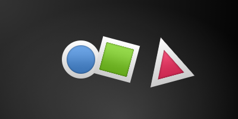
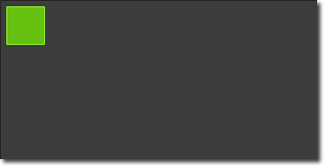

=============
Inicio Rapido
=============

.. sectionauthor:: `jryannel <https://github.com/jryannel>`_, `Carlos Hernandez <https://github.com/CharlieGearsTech>`_

.. issues:: ch04

.. note::

    Last Build: |today|

    El codigo fuente de este capitulo puede ser encontrado en:  <../../assets>`_.

Este capitulo provee un vistazo a QML, el lenguaje de interfaz de usuario declarativo usado en Qt 5. Vamos a discutir la sintaxis de QML, que es una jerarquia tipo árbol de elementos, siguiendo un vistazo de los elementos básicos mas importantes. Después de eso, tendremos un vistazo rápido a como crear nuestros propios elementos, llamados componentes y como transformar elementos usando manipuladores de propiedades. Hacia el final, tendremos un vistazo a como colocar elementos juntos en un "layout" y finalmente checar los elementos donde el usuario provee entradas.

Sintaxis de QML
===============

.. issues:: ch04

.. index:: qmlscene, properties, scripting, binding, syntax

QML es un lenguaje declarativo usado para describir interfaces de usuario en tu aplicación. Separa la interfaz de usuario dentro de elementos mas pequeños, cuales pueden ser combinados como componentes. QML describe la vista y el comportamiento de estos elementos de interfaz de usuario. Esta descripción de interfaz de usuario puede ser enriquecido con código de JavaScript para proveer una lógica simple pero mas compleja. En esta perspectiva, QML sigue el patrón de HTML-JavaScript pero QML esta diseñado desde cero para describir interfaces de usuario y no documentos de texto.

QML, en su forma mas fácil, es una jerarquía de elementos. Elementos hijos heredan el sistema de coordenadas del padre. Una coordenada ``x,y``  es siempre relativa a su padre.

.. figure:: assets/scene.png

Empecemos con un ejemplo simple de un archivo QML para explicar las diferentes sintaxis.

.. literalinclude:: src/concepts/RectangleExample.qml
    :start-after: M1>>
    :end-before: <<M1

* La palabra ``import`` importa un modulo de una versión especifica. En general, tu siempre querrás importar desde *QtQuick 2.0* (o versiones superiores) como un conjunto inicial de elementos.
* Comentarios pueden ser realizadas usando ``//`` para comentarios de un solo renglón o ``/* */`` para comentarios de múltiples lineas. Similar como C/C++ y JavaScript..
* Cada archivo QML necesita tener unicamente un elemento base, como HTML.
* Un elemento es declarado por su tipo seguido con ``{ }``
* Elementos pueden tener propiedades, las propiedades están en la forma ``nombre : valor``
* Elementos arbitrarios adentro de un documento QML pueden ser accedidos usando su propiedad ''id'' (un identificador sin comillas).
* Elementos pueden ser anidados, refiriéndose a que un elemento padre puede tener varios elementos hijos. El elemento padre puede ser accedido usando la palabra ''parent''.

.. tip::

		Normalmente tu querras acceder un elemento en particular por el id, o un elemento padre usando la palabra ``parent``. Es una buena practica llamar tu elemento base como "root" o "base" usando ``id: root``. ENtonces no tendras que pensar acerca de como los elementos base son llamados en tu documento QML.

.. hint::

	Puedes ejecutar un ejemplo usando el runtime de Qt Quick desde la linea de comandos de tu OS como este:

		$ $QTDIR/bin/qmlscene RectangleExample.qml

	Donde necesitas reemplazar la palabra *$QTDIR* con la dirección de tu instalación de Qt. El ejecutable *qmlscene* inicializa el runtime de Qt Quick e interpreta el archivo QML que se proveo.

	In Qt Creator puedes abrir el proyecto correspondiente y ejecutar el documento ''RectangleExample.qml''

Propiedades
----------

.. issues:: ch04

Elementos son declarados usando sus nombres, pero son definidos usando sus propiedades, o creando propiedades personalizadas. Una propiedad es un par simple de llave-valor, por ejemplo: ``width : 100``, ``text: 'Greetings'``, ``color: '#FF0000'``. Una propiedad tiene un tipo bien definido y puede tener un valor inicial.

.. literalinclude:: src/concepts/PropertiesExample.qml
    :start-after: M1>>
    :end-before: <<M1
Veamos las diferentes caracteristicas de las propiedades:

(1) ''id'' es una propiedad bastante especial, es usado para hacer referencia a elementos adentro de un archivo QML (llamado "documento" en QML). El ''id'' no es tipo string, si no un identificador y parte de la sintaxis de QML. Un ''id'' necesita ser unico adentro de un documento y no puede agregar otro valor ya ingresado, y no debería ser encolado. (id se comporta más como un puntero en el mundo de C++).

(2) Una propiedad puede obtener un valor, dependiendo del tipo. Si un valor no fue dado a una propiedad un valor inicial va a ser seleccionado. Necesitas consultar la documentación de un elemento en particular para más información acerca de su valor inicial.

(3) Una propiedad puede depender de uno u otras propiedades. Esto es llamado *enlazamiento*. Una propiedad enlazada es actualizada, cuando la propiedad dependiente cambia. Funciona como un contrato, en este caso ``height``siempre debe de ser 2 veces el ``width``.

(4) Puedes agregar tus propias propiedades a un elemento usando el cualificador ``property`` seguido con su tipo, el nombre y un valor inicial optional (``property <type> <name> : <value>``). Si un valor inicial no es dado, entonces un valor inicial del sistema es seleccionado.

.. note:: También puedes declarar una propiedad para ser una propiedad por default si no se definió un nombre de propiedad, esto se realiza agregando al inicio de una declaración de propiedad la palabra ''default''. Esto es usado, por ejemplo cuando se agrega elementos hijos, el elemento hijo es agregado automáticamente para la propiedad por default ''children'' de la lista de tipos si este tipo es visible a los elementos.

(5) Otra manera importante de declarar propiedades es usando la palabra ``alias`` ``property alias <nombre> : <referencia>``). La palabra ''alias'' nos permite adelantar una propiedad de un objecto o un objeto en si desde adentro del tipo a un alcance externo. Vamos a usar esta técnica después cuando definamos componentes para exportar las propiedades internas o id de elementos para un nivel del componente base. Un alias de propiedad no necesita un tipo, usa el tipo de la propiedad o objecto referenciado.

(6) La propiedad ''text'' depende en la propiedad personalizada ''times'' de tipo int. El valor basado en ''int'' es convertido automáticamente a un tipo ''string''. La expresión en si es otro ejemplo de enlazamiento y resulta en el texto actualizándose cada vez que la propiedad ''times'' cambia.

(7) Algunas propiedades son propiedades agrupadas. Este es un rasgo que es usado cuando una propiedad esta más estructurada y propiedades relacionadas entre si deberían ser agrupadas. Por ejemplo, otra forma de escribir en propiedades agrupadas es ''font { family: "Ubuntu"; pixelSize: 24 }''.

(8) Algunas propiedades están relacionadas con un solo elemento. Esto está hecho para elementos de relevancia global cuales aparecen solamente una vez en la aplicación (por ejemplo, entrada de teclado). La escritura es ``<Element>.<property>: <value>``.

(9) Para cada propiedad puedes proveer un manejador de señal. Este manejador es llamado después de los cambios de una propiedad. Por ejemplo, aquí queremos ser notificados en cualquier momento de los cambios en la altura del rectángulo, y así usar una consola para registrar un mensaje al sistema.

.. warning:: Un id de un elemento debe ser usado unicamente como referencia de elementos dentro de tu documento ( tu archivo actual). QML provee un mecanismo llamado "alcance dinámico" donde recientes documentos cargados sobrescriben los ids de documentos mas antiguos. Esto hace posible hacer referencia a ids de elementos en los documentos antiguos, si estos no han sido sobrescritos. Es como crear variables globales. Desafortunadamente, esto frecuentemente nos lleva a realizar malas practicas de código, donde el programa depende de la orden de ejecución. Desafortunadamente esto no puede apagarse. Usa este rasgo con cuidado o mejor no lo uses. Es mejor exportar elementos que quieres ofrecer al mundo exterior usando propiedades en los elementos de la base de tu documento.

Scripting
---------

.. issues:: ch04

QML y JavaScript (tambien conocido como ECMAScript) son los mejores amigos. En el capitulo de *JavaScript* vamos a ir más en detalle en este simbiosis. Actualmente queremos hacer notar esta relación.

.. literalinclude:: src/concepts/ScriptingExample.qml
    :start-after: M1>>
    :end-before: <<M1

(1) El manipulador de cambios de texto ``onTextChanged`` imprime el texto actual cada vez que este texto cambia debido a que se presiona la barra espaciadora.

(2) Cuando el elemento texto recibe un click de la barra espaciadora (porque el usuario presiono la barra espaciadora en el teclado) llamamos una funcion JavaScript ``increment()``.

(3) Definición de una funcion JavaScript en la forma de ``function <name>(<parameters>) { ... }``, cual incrementa nuestro contador ``spacePressed``. Cada vez que ``spacePressed`` incrementa, las propiedades enlazadas se actualizaran.

.. note:: La diferencia entre QML ``:`` (enlace) y de JavaScript ``=``( asignacion) es, que que el enlace es un contrato y continua siendo verdad durante la vida del enlace, miestras que la asignacion de JavaScript es una asignacion de valor de un solo tiempo.
		La vida de enlaces terminan cuando un nuevo enlace es puesto en la propiedad o incluso cuando un valor JavaScript es asignado a la propiedad. Por ejemplo la puesta de una propiedad de texto en el manipular de text a una cadena vacia podria destruir nuestro despliegue de increment

        Keys.onEscapePressed: {
        label.text = ''
    		}
		
		Despues de presionar escape, el presionar la barra espaciadora no actualizara la vista otra vez, debido a que el enlace de la propiedad ``text`` (*text: "Space pressed: " + spacePresses + " times"*) ha sido destruido.

		Cuando tienes conflicto en estrategias para cambiar una propiedad como en este caso (texto actualizado por un cambio de un incremento de una propiedad por un enlace y limpieza de texto por un asignación de JavaScript) no podrás usar enlaces! Necesitas usar asignación en las dos patrones de cambios de propiedades, ya que el enlace sera destruido por la asignación (contrato roto!).

Elementos Basicos
==============

.. issues:: ch04

.. index:: Item, Rectangle, Text, MouseArea, Image, gradients

Elementos pueden ser agrupados dentro de elementos visuales y no visuales. Un elemento visual (como ``Rectangle``) tiene una geometria y normalmente se presenta en un area del monitor. Un elemento no visual (como un``Timer``) provee una funcionalidad general, normalmente usado para manipular elementos visuales. 

Actualmente, nos enfocaremos en elementos visuales fundamentales, tales como `Item``, ``Rectangle``, ``Text``, ``Image`` y ``MouseArea``.

Elemento Item
------------

.. issues:: ch04

``Item`` es un elemento base para todo elemento visual, tal como los otros elementos visuales heredan de ``Item``. No pinta nada más que el mismo pero define todas las propiedades que son comunes entre todos los elementos visuales.

.. list-table::
    :widths: 20,80
    :header-rows: 1

    *   - Grupo
        - Propiedades
    *   - Geometría
        - ``x`` y ``y`` para definir el extremo superior-izquierdo, ``width`` y ``height`` para expander el elemento y  ``z`` para sobreponer elementos entre si arriba y abajo para modificar su orden natural.
    *   - Manejador de planos
        - ``anchors`` (izquierda, derecha, arriba, abajo, centro vertical y horizontal) para posicionar elementos entre ellos con sus ``margins``.
    *   - Manejador de teclado
        - embebido en las propiedades ``Key`` y ``KeyNavigation`` para controlar manejo de teclado y la entrada, la propiedad ``focus`` para permitir este manejo de teclado.
    *   - Transformación
        - ``scale`` y ``rotate`` transformaciones y la lista de propiedades generica ``transform`` para transformaciones en *x,y,z* y sus puntos de ``transformOrigin``.
    *   - Visual
        - ``opacity`` para controlar transparencia, ``visible`` para mostrar/ocultar elementos, ``clip`` para restringir operaciones de pintado para el perímetro del elemento y ``smooth`` para mejorar la calidad de render.
    *   - Definición de estado
        - La lista de propiedades ``states`` con soporte de listas de estados y la propiedad del actual ``state`` como también la lista de propiedades ``transitions`` para animar cambios entre estados.

Para mejorar el aprendizaje de las diferentes propiedades, trataremos de introducirlos dentro de este capitulo en el contexto de los elementos presentados. Recuerda que estas propiedades fundamentales están disponibles en cada elemento visual y trabajan igual entre estos elementos.

.. note::

    El elemento ``Item`` es normalmente usado como contenedor de otros elementos, similar al elemento *div* en HTML.

Elemento Rectangulo
-----------------

.. issues:: ch04

El elemento ``Rectangle`` extiende ``Item`` y agrega un color a este mismo. Adicionalmente soporta perimetors definido por ``border.color`` y ``border.width``. Para crear un rectangulo achatado puedes usar la propiedad ``radious``. 

.. literalinclude:: src/concepts/RectanglesExample2.qml
    :start-after: M1>>
    :end-before: <<M1

.. figure:: assets/rectangle2.png

.. note::

    Hay nombres de colores que son validos como los nombres de colores de un SVG (ve  http://www.w3.org/TR/css3-color/#svg-color). Puedes proveer colores a QML en diferentes maneras, pero el mas usado es la cadena de RGB ('#FF4444') o un nombre de color (ejemplo: 'white').

Aparte del color de relleno y borde, el rectangulo tambien soporta gradientes personalizados.

.. literalinclude:: src/concepts/RectanglesExample3.qml
    :start-after: M1>>
    :end-before: <<M1

.. figure:: assets/rectangle3.png

Un gradiente es definido como una serie de paradas de gradiente. Cada parada tiene una posición y un color. La posición marca el posicionamiento en el eje y (0 = arriba, 1= abajo). El color de ``GradientStop`` marca el color de esa posición.

.. note::

	Un rectángulo sin *width/height* no sera visible. Esto pasa normalmente cuando tienes bastantes anchos(altos) de los rectángulos dependiendo de las propiedades de los otros rectángulos y algo va mal en tu lógica de composición. Ponte atento!

.. note::

	No es posible el crear un gradiente inclinado. Para esto, es mejor el usar imágenes predefinidas. Una posibilidad puede ser que puedas rotar el rectángulo con el gradiente, pero debes de estar consiente de la geometría de un rectángulo inclinado no cambiara y entonces llegara a confusión cuando la geometría del elemento no es la misma que el área visible. Desde la perspectiva del autor, es mucho mejor el usar imágenes con gradientes diseñados en este caso.

Elementos de Texto
------------

.. issues:: ch04

Para desplegar texto, puedes usar el elemento ``Text``. La propiedad más notable de ``Text`` es la propiedad ``text`` de tipo ``string``. El elemento calcula su ancho y altura inicial basado en el texto y fuente que fue dado. La fuente puede ser modificado usando el grupo de propiedades de font (por ejemplo, ``font.family``,``font.pixelSize``,...). Para cambiar el color del texto solo usa la propiedad ``color``.

.. literalinclude:: src/concepts/TextExample.qml
    :start-after: M1>>
    :end-before: <<M1

|

.. figure:: assets/text.png

Texto puede ser alineado a cada extremo o centro del elemento usando las propiedades ``horizontalAlignment`` y ``verticalAlignment``. Para realzar la calidad del texto puedes usar las propiedades ``style`` y ``styleColor``, cuales te permiten renderizar el texto en modo enlineado, resaltado y sumergido. Para textos más largos, querras definir una posición *break* como * Un extenso... largo texto*, esto puede ser realizado usando la propiedad ``elide``. La propiedad ``elide`` te permite crear una posición de supresión a la izquierda, derecha o en medio de tu texto. En caso de que no quieras el '...' del modo elide para aparecer pero aún quieres ver el texto completo, también puedes envolver el texto usando la propiedad ``wrapMode`` (funciona unicamente cuando el ancho fue puesto explícitamente):

    Text {
        width: 40; height: 120
        text: 'A very long text'
        // '...' deberia aparecer enmedio
        elide: Text.ElideMiddle
        // Estilo de texto sumergido rojo
        style: Text.Sunken
        styleColor: '#FF4444'
        // Alinea el texto hacia arriba
        verticalAlignment: Text.AlignTop
        // Sensible cuando el elide mode no ha sido establecido
        // wrapMode: Text.WordWrap
    }

Un elemento ``Text`` solo despliega el texto dado. No renderiza ninguna decoración del fondo. Por otro lado, el texto renderizado, el elemento ``Text`` es transparente. Es parte del diseño completo para proveer un fondo sensible a los elementos de texto.

.. note::
		Se conciente que el ancho ( y alto) inicial de ``Text`` depende de la cadena de texto y de la fuente establecida. Un elemento ``Text`` que no tiene ancho establecido ni texto, no sera visible, debido a que su ancho inicial va a ser 0.

.. note::

		Normalmente cuando quieres alinear elementos de ``Text`` necesitas diferencias entre alinear el texto dentro del perímetro del rectángulo del elemento ``Text`` o alinear el perímetro del rectángulo por si mismo. En el caso que quieras usar las propiedades ``horizontalAlignment`` y ``verticalAlignment`` en el ultimo caso querrás manipular la geometría del elemento usando anclas.

Elemento de Imagen
-------------

.. issues:: ch04

Un elemento ``Image`` puede desplegar imágenes de varios formatos (ejemplo, PNG, JPG, GIF, BMP, WEBP). * Para la lista completa de los formatos de imagenes soportados, consulta la documentación de Qt*. Aparte de la propiedad obvia ``source`` para proveer la URL de la imagen, ``Image`` contiene una propiedad ``fillMode`` que controla el comportamiento de modificación de tamaño.

.. literalinclude:: src/concepts/ImageExample.qml
    :start-after: M1>>
    :end-before: <<M1

.. figure:: assets/image.png

.. note::

    Una URL puede ser una direccion local con diagonales hacia la derecha ("./images/home.png") o un link de la web (ejemplo "http://example.org/home.png").

.. note::

		Elementos ``Image`` usando la propiedad ``PreserveAspectCrop`` tambien deberan permitir el recorte para evitar que los datos de la imagen sean renderizados afuera del perímetro de ``Image``. Por defecto, recorte esta deshabilitado (``clip: false``). Necesitas permitir recorte (``clip: true``) para contener el pintado de los elementos en su rectángulo de perímetro. Esto puede ser usado en cualquier elemento visual.

.. tip::
		Usando C++, puedes crear tu propio proveedor de imágenes usando :qt5:`QQmlImageProvider <qqmlimageprovider>`. Esto permite crear imágenes al vuelo y enhilar carga de imagen.

Elemento de Área de Ratón
-----------------

.. issues:: ch04

Para interaccionar con estos elementos, normalmente usaras un ``MouseArea``. ``MouseArea`` es un elemento rectangular invisible donde puedes capturar eventos del ratón. El Área de Ratón es normalmente usado junto con un elemento visible para ejecutar comandos cuando el usuario interaccioná con esta parte visual.

.. literalinclude:: src/concepts/MouseAreaExample.qml
    :start-after: M1>>
    :end-before: <<M1

.. list-table::
    :widths: 50 50

    *   - .. figure:: assets/mousearea1.png
        - .. figure:: assets/mousearea2.png

.. note::
		Este es un aspecto importante de Qt Quick, el manipulador de entrada esta separado de la presentación visual. Esto te permite mostrar al usuario un elemento de interfaz, pero el área de interacción puede ser mas grande.
		
Componentes
==========

.. issues:: ch04

.. index:: components

Un componente es un elemento reusable, QML provee diferentes maneras de crear componentes. Actualmente veremos unicamente a la forma mas simple- un componente basado en archivos. Un componente basado en archivo es creado al agregar un elemento QML en un archivo y dar al archivo un nombre de elemento (por ejemplo, ``Button.qml``). Puedes usar este componente como cualquier otro componente del modulo de QtQuick, en nuestro caso, usarías este en tu código como ``Button{...}``.

Por ejemplo, vamos a crear un rectángulo conteniendo un componente de texto y una área de ratón. Esto compone un botón simple y no necesita ser mas complicado para nuestros propósito

.. literalinclude:: src/elements/InlinedComponentsExample.qml
    :start-after: M1>>
    :end-before: <<M1

El UI se vera similar a esto. A la izquierda del UI esta el estado inicial, en la derecha después de que el botón fue presionado.

.. list-table::
    :widths: 50 50

    *   - .. figure:: assets/button_waiting.png
        - .. figure:: assets/button_clicked.png

Nuestro trabajo ahora es de extraer el UI del botón en un componente re-utilizable. Para hacer esto, podemos pensar por una posible API para nuestro botón. Puedes hacer esto imaginando como alguien mas debería usar tu botón. Esto es lo que encontré:

.. code-block:: js

    // API minimo para un boton
    Button {
        text: "Presioname"
        onClicked: { // Haz algo }
    }

Me gustaría establecer el texto usando una propiedad ``text`` e implementar mi propio manipulador de clicks. Ademas, yo esperaría que el botón tuviera un tamaño inicial sensible, el cual yo pueda sobrescribir (ejemplo, con ``width: 240``).

Para cumplir con esto, hemos creado un archivo ``Button.qml`` y copiar adentro nuestro UI del botón. Adicionalmente, necesitamos exportar las propiedades que el usuario quisiera cambiar en el nivel base.

.. literalinclude:: src/elements/Button.qml
    :start-after: M1>>
    :end-before: <<M1

Hemos exportado el texto y la senal de click para el nivel de la base. Tipicamente, llamamos nuestro elemento base como root para hacer la referencia mas facil. Usamos el rasgo de QML ``alias``, que es una manera de exportar propiedades dentro de elementos QML anidados para el nivel base, y hacerlos accesibles al mundo exterior. Es importante saber, que solamente las propiedades de nivel de la base pueden ser accedidos desde afuera del archivo por otros componentes.

Para usar nuestro nuevo elemento ``Button``, podemos simplemente declararlo en nuestro archivo. En el ejemplo anterior puede convertirse un poco simplificado:

.. literalinclude:: src/elements/ReusableComponentExample.qml
    :start-after: M1>>
    :end-before: <<M1

Ahora puedes usar tantos botones como tu quieras en tu UI usando nada mas ``Button{...}``. Un botón real puede ser mas complejo, por ejemplo, ofreciendo retroalimentación cuando es presionado y mostrar una decoración mas amigable.

.. note::

    Puedes incluso ir un paso mas adelante y usar un artículo  como un elemento base. Esto previene usuarios de cambiar el color de nuestro botón diseñado, y nos provee con mayor control acerca de la API exportada. El objetivo debe ser exportar una API mínima. Prácticamente, esto significa que podríamos necesitar reemplazar la base ``Rectangle`` con un ``Item`` y hacer el rectángulo un elemento anidado con el articulo base.

    |

    .. code-block:: js

        Item {
            id: root
            width: 116; height: 26

            property alias text: label.text
            signal clicked

            Rectangle {
                anchors.fill parent
                color: "lightsteelblue"
                border.color: "slategrey"
            }
            ...
        }

Con este técnica, es fácil crear series completas de componentes re utilizables.

Transformaciones Simples
======================

.. issues:: ch04

.. index:: Transformation, Translation, Rotation, Scaling, ClickableImage Helper, Stacking order

Una transformación manipula la geometría de un objeto. Artículos de QML pueden en general ser trasladados, girados o escalados. Hay una simple forma para realizar estas operaciones y una forma mas avanzada.

Vamos a comenzar con una transformación simple. Aquí esta nuestra escena como nuestro punto de partida.

Una traslación simple es hecha cambiando las posiciones ``x,y``. Una rotación es hecha usando la propiedad ``rotation``. El valor esta en grados (0 ... 360). Una escalada es hecha usando la propiedad ``scale`` y un valor ``<1`` significa que el elemento es reducido, y ``>1`` significa que el elemento es aumentado. La rotación y escalado no cambian la geometría del articulo. Los valores ``x,y`` del articulo y ``width/height`` no han cambiado; solamente las instrucciones han sido transformados.

Antes de demostrar un ejemplo, quisiera introducir una pequeña ayuda: El elemento ``ClickableImage``. Este elemento es solo una imagen con una área de ratón. Esto conlleva una regla de pulgar bastante útil- si vas a copiar un paquete de código 3 veces, extrae este paquete dentro de un componente.

.. literalinclude:: src/transformation/ClickableImage.qml
    :start-after: M1>>
    :end-before: <<M1

.. figure:: assets/objects.png

Usamos nuestra imagen clickeable para presentar 3 objectos (caja, circulo, y triangulo). Cada objeto realiza una simple transformación cuando es presionado. Presionando el fondo se restablecera el escenario.

.. literalinclude:: src/transformation/TransformationExample.qml
    :start-after: M1>>
    :end-before: <<M1

El circulo incrementa su posición x en cada click, y la caja rotara en cada click. El triangulo rotara y escalara la imagen en cada click, para demostrar la transformación combinada. Para las operaciones de escalación y rotación estableceremos ``antialiasing: true`` para permitir anti-aliasing, cual no es activado defecto (como la propiedad de recorte ``clip``) debido a razones de rendimiento. En tu propio trabajo, cuando veas  puntas rasterizadas en tus gráficos, entonces deberías activar ``smooth``.

.. note::

    Para obtener una mejor calidad visual cuando escales imágenes, es recomendado reducir imágenes en vez de aumentarlas. Aumentando una imagen con un factor de escala alto resultara en artefactos de escala (imágenes borrosas). Cuando escales tu imagen, deberías considerar usar ``antialiasing: true`` para permitir el uso del filtro de mejor calidad.

El ``MouseArea`` del fondo esta en todo el fondo, y restablece los valores de los objetos.

.. note::

    Elementos que aparecen al principio del código tienen un ordenamiento menor en la cola (llamado ordenamiento-Z). Si das un largo click en ``circle`` veras que se mueve abajo de ``box``. El ordenamiento-Z puede ser manipulado por la propiedad ``z`` en el articulo.

    .. figure:: assets/objects_overlap.png

    Esto es debido a que ``box`` aparece después en el código. Lo mismo aplica en las áreas de ratón. Una área de ratón al final del código estará encima (y atrapara los eventos de mouse) que las áreas de ratón que están al principio del código.
    
    Recuerda *El orden de los elementos en el documento importa*

Elementos de Posicionamiento.
====================

.. issues:: ch04

.. index:: Row, Column, Grid, Repeater, Flow, Square Helper

Hay un numero de elementos de QML usados para posicionar artículos. Estos son llamados posicionadores y los siguientes están en el modulo QtQuick ``Row``,``Column``, ``Grid`` and ``Flow``. Ellos pueden ser mostrados con el mismo contenido en la ilustración de abajo.

.. todo: illustration showing row, grid, column and flow side by side showing four images

.. note::

    Antes de entrar a detalles, dejame introducir algunos elementos de ayuda. Los cuadrados, rojos, verdes, transparentes y opacos. Cada uno de estos componentes contienen un rectángulo coloreado por 48x48 pixeles. Como referencia aquí esta el código fuente de ``RedSquare``.

    .. literalinclude:: src/positioners/RedSquare.qml
        :start-after: M1>>
        :end-before: <<M1

    Nota que el uso de ``Qt.lighter(color`` produce un color de borde mas transparente en el color de fondo. Vamos a usar estos elementos de ayuda en los siguientes ejemplos para hacer el codigo fuente mas compato y posiblemente mas entendible. Recuerda que cada rectangulo es 48x48 pixeles inicialmente.

El elemento ``Columna`` acomoda artículos hijos dentro de una columna, enpilandolos arriba de cada uno. La propiedad ``spacing`` puede ser usado para distanciar cada uno de los elementos hijos entre ellos.

.. figure:: assets/column.png

.. literalinclude:: src/positioners/ColumnExample.qml
    :start-after: M1>>
    :end-before: <<M1

The ``Row`` element places its child items next to each other, either from the left to the right, or from the right to the left, depending on the ``layoutDirection`` property. Again, ``spacing`` is used to separate child items.

.. literalinclude:: src/positioners/RowExample.qml
    :start-after: M1>>
    :end-before: <<M1

El elemento ``Grid`` acomoda sus hijos en una cuadricula, estableciendo las propiedades ``row`` y ``columns``, el numero de filas y columnas pueden ser limitadas. Al no establecer ninguno de los dos, el orden es calculado desde el numero de artículos hijos. Como instancia, estableciendo filas de 3 y añadiendo 6 artículos hijos, resultara en 2 columnas. Las propiedades ``flow`` y ``layoutDirection`` son usados para el control del orden en cual los artículos son añadidos a la cuadricula, mientras ``spacing`` controla la cantidad de espacio que separa los artículos hijos.

.. figure:: assets/grid.png

.. literalinclude:: src/positioners/GridExample.qml
    :start-after: M1>>
    :end-before: <<M1

El posicionador final es ``Flow``. ``Flow`` agrega sus artículos hijos en un flujo. La dirección del flujo es controlado mediante ``flow`` y ``layoutDirection``. Puede correr por los lados, o de arriba para abajo. Puede correr a la izquierda o en la dirección opuesta. Como sus artículos son agregados al flujo, ellos pueden ser envueltos en forma de nuevas columnas y filas como sean necesarios. En orden de que un flujo funcione, debe de tener un ancho y algo. Esto puede ser establecido directamente o mediante trazas de anclas.

.. figure:: assets/flow.png

.. literalinclude:: src/positioners/FlowExample.qml
    :start-after: M1>>
    :end-before: <<M1

Un elemento que es usado normalmente con posicionadores es ``Repeater``. Funciona como un ciclo for e itera el modelo. En el caso mas simple, el modelo es solamente un valor provenido la cantidad de ciclos.

.. figure:: assets/repeater.png

.. literalinclude:: src/positioners/RepeaterExample.qml
    :start-after: M1>>
    :end-before: <<M1

En este ejemplo de repetidor, usamos algo de magia. Aquí definimos nuestro propia propiedad color, que usamos como un arreglo de colores. El repetidor crea una seria de rectángulos (16, como define la propiedad ``model``) En cada ciclo el repetidor crea el rectángulo definido por su hijo. En el rectángulo, escogimos el color usando la función math de JS ``Math.floor(Math.random()*3)``.Esto nos da un numero aleatorio en el rango de 0..2, que usamos para seleccionar un color desde nuestro arreglo de color. Como explicamos anteriormente, JavaScript es una parte central de Qt Quick, como también las librerías estándares están disponibles para nosotros.

Un repetidor inyecta la propiedad ``index``.``index`` contiene el indice actual del ciclo (0,1,...,15). Nosotros podemos usar esto para realizar nuestras propias decisiones basados en el indice; o en nuestro caso, visualizar el indice actual con el elemento ``Texto``.

.. note::

		Manejadores mas avanzados de modelos mas largos y vistas quinéticas con delegados dinámicos es cubierto en nuestro capitulo de Modelo-Vista. Repetidores son mejores usados cuando tienes un pequeño conjunto de datos estáticos para ser presentados.

Articulos de Trazo
============

.. issues:: ch04

.. index:: anchors

.. todo:: do we need to remove all uses of anchors earlier?

QML provee una manera flexible de trazar artículos usando anclas. El concepto de anclar es parte de las propiedades fundamentales de ``Item`` y esta disponible para todos los elementos visuales de QML. Una ancla actuá como si fuera un contrato y es mas fuerte que la competencia de cambios geométricos. Anclas son expresiones de relativismo, tu siempre necesitaras un elemento relacionado con un ancla.

.. figure:: assets/anchors.png

Un elemento tiene 6 lineas principales de anclas (arriba, abajo, izquierda, derecha, centro Horizontal, centro Vertical). Adicionalmente esta la ancla de linea base para texto en elementos de ``Text`` Cada linea de ancla viene con un indice. En el caso de arriba, abajo, izquierda, y derecha, ellos son llamados margenes. Para centro Horizontal, centro Vertical y linea base, ellos son llamados offsets.

.. figure:: assets/anchorgrid.png

#. Un elemento llena a su padre.

    .. literalinclude:: src/anchors/AnchorsExample.qml
        :start-after: M1>>
        :end-before: <<M1

#. Un elemento es alineado a la izquierda de su padre.

    .. literalinclude:: src/anchors/AnchorsExample.qml
        :start-after: M2>>
        :end-before: <<M2

#. Un elemento es alineado a la derecha de su padre.

    .. literalinclude:: src/anchors/AnchorsExample.qml
        :start-after: M3>>
        :end-before: <<M3

#. Elementos alineados en el centro. ``Blue1`` es centrado horizontalmente en el padre. ``Blue2`` es también centrado horizontalmente pero con ``Blue1`` linea inferior arriba de su linea superior.

    .. literalinclude:: src/anchors/AnchorsExample.qml
        :start-after: M4>>
        :end-before: <<M4

#. Un elemento es centrado en su padre

    .. literalinclude:: src/anchors/AnchorsExample.qml
        :start-after: M5>>
        :end-before: <<M5

#. Un elemento es centrado en la compensación izquierda en el elemento padre usando lineas de centro verticales y horizontales. 

    .. literalinclude:: src/anchors/AnchorsExample.qml
        :start-after: M6>>
        :end-before: <<M6

.. note:: Nuestros cuadrados han sido mejorados para permitir desplazamiento. Intenta este ejemplo y desplaza algunos cuadrados. Vas a ver que (1) no puede ser desplazado ya que esta anclado en todos sus sitios, claro puedes desplazar el padre de (1) que no esta anclado con nada. (2) puede ser desplazado verticalmente, debido a que su parte izquierda esta anclado. Aplica similarmente con (3). (4) solo puede ser desplazado verticalmente debido a que los dos cuadrados están centrados horizontalmente. (5) esta centrado en el padre, y debido a seso no puede ser desplazado, aplica similar para (7). Desplazar un elemento significa cambiar la posición ``x,y`` de un elemento. Como anclaje es mas fuerte que cambios de geometría como ``x,y``, desplazamiento esta restringido en las lineas ancladas. Vamos a ver este efecto despues cuando discutamos animaciones.

Elementos de Entrada
==============

.. issues:: ch04

.. index:: TextInput, TextEdit, FocusScope, focus, Keys, KeyNavigation

We have already used the ``MouseArea`` as a mouse input element. Next, we'll  focus on keyboard input. We start off with the text editing elements: ``TextInput`` and ``TextEdit``.

TextInput
---------

.. issues:: ch04

The ``TextInput`` allows the user to enter a line of text. The element supports input constraints such as ``validator``, ``inputMask``, and ``echoMode``.

.. literalinclude:: src/input/TextInputExample.qml
    :start-after: M1>>
    :end-before: <<M1

.. figure:: assets/textinput.png

El usuario puede dar click adentro de un ``TextInput`` para cambiar el enfoque. Para soportar cambios en el enfoque desde el teclado, podemos usar la propiedad adjunta ``KeyNavigation``

.. literalinclude:: src/input/TextInputExample2.qml
    :start-after: M1>>
    :end-before: <<M1

La propiedad adjunta ``KeyNavigation`` soporta un conjunto preestablecido de botones de navegación donde los ID de los elementos están enlazados con el cambio de enfoque de la especifica llave presionada.

Un elemento de entrada de texto viene con ninguna presentación visual, aparte del cursor parpadeante y el texto definido. Para el usuario, reconocer un elemento como elemento de entrada, requiere una decoración visual; por ejemplo un rectángulo simple. Al poner el ``TextInput`` adentro de un elemento, necesitas estar seguro que estas exponiendo las propiedades principales que quieres que otros puedan acceder.

Podemos mover este pedazo de código para nuestro componente llamado ``TLineEditV1`` para re usarlo.

.. literalinclude:: src/input/TLineEditV1.qml
    :start-after: M1>>
    :end-before: <<M1

.. note::

		Si quieres exportar un ``TextInput`` completamente, tu puedes exportar el elemento usando ``property alias input: input``. El primer ``input`` es un nombre de propiedad, donde el segundo input es el ID del elemento.

Reescribimos nuestro ejemplo de ``KeyNavigation`` con el nuevo componente ``TLineEditV1``:

.. code-block:: js

    Rectangle {
        ...
        TLineEditV1 {
            id: input1
            ...
        }
        TLineEditV1 {
            id: input2
            ...
        }
    }

.. figure:: assets/textinput3.png

Y tratando la llave TAB para navegación. Tu vas a experimentar que el enfoque no cambia a ``input2``. El simple uso de ``focus:true`` no es suficiente. El problema persiste, que el enfoque fue transferido al elemento ``input2``, el elemento de mayor nivel adentro del TLineEditV1 (un rectángulo) recibe el enfoque y no permite el enfoque al TextInput. Para prevenir esto, QML ofrece el ``FocusScope``.

Alcance de Enfoque
----------

.. issues:: ch04

Un alcance de enfoque declara que el ultimo elemento hijo con ``focus:true`` recibe el enfoque, si el alcance de enfoque recibe el enfoque. De esta manera, permite el enfoque  con el ultimo elemento hijo que requirió el enfoque. Vamos a crear una segunda versión de nuestro componente TLineEditV2 usando el alcance de enfoque como elemento base.

.. literalinclude:: src/input/TLineEditV2.qml
    :start-after: M1>>
    :end-before: <<M1

Nuestro ejemplo ahora se vera así:

.. code-block:: js

    Rectangle {
        ...
        TLineEditV2 {
            id: input1
            ...
        }
        TLineEditV2 {
            id: input2
            ...
        }
    }

Presionando la tecla TAB, ahora cambia satisfactoriamente el enfoque entre los 2 componentes, y el elemento hijo correcto adentro del componente esta enfocado.

Editor de Texto
--------

.. issues:: ch04

El elemento ``TextEdit`` es muy similar a ``TextInput``, y soporta áreas de texto de múltiples lineas. No tiene las propiedades de restricción de texto, ya que depende del encolamiento del tamaño de pintado del texto (``paintedHeight``, ``paintedWidth``). Nosotros también creamos nuestro propio componente llamado ``TTextEdit`` para entregar un fondo de edición y usar el alcance de enfoque para mejor traslado de enfoque.

.. literalinclude:: src/input/TTextEdit.qml
    :start-after: M1>>
    :end-before: <<M1

Puedes usarlo como el componente ``TLineEdit``

.. literalinclude:: src/input/TextEditExample.qml
    :start-after: M1>>
    :end-before: <<M1

.. figure:: assets/textedit.png

Elementos Botones
------------

.. issues:: ch04

La propiedad adjunta ``Keys`` permite ejecutar código basado en click de botones específicos. Por ejemplo, para mover un cuadrado y escalarlo, podemos enganchar las llaves arriba, abajo, izquierda y derecha para traducir el elemento y los botones + and - para escalar el elemento.

.. literalinclude:: src/input/KeysExample.qml
    :start-after: M1>>
    :end-before: <<M1

Tecnicas Avanzadas
===================

.. issues:: ch04

.. todo:: To be written

