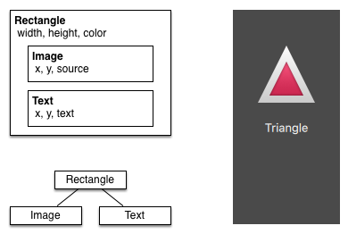
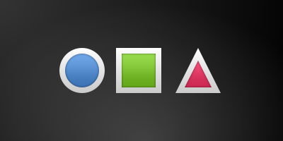

=============
Inicio Rapido
=============

.. sectionauthor:: `jryannel <https://github.com/jryannel>`_, `Carlos Hernandez <https://github.com/CharlieGearsTech>`_

.. issues:: ch04

.. note::

    Last Build: |today|

    El codigo fuente de este capitulo puede ser encontrado en:  <../../assets>`_.

Este capitulo provee un vistazo a QML, el lenguaje de interfaz de usuario declarativo usado en Qt 5. Vamos a discutir la sintaxis de QML, que es una jerarquia tipo árbol de elementos, siguiendo un vistazo de los elementos básicos mas importantes. Después de eso, tendremos un vistazo rápido a como crear nuestros propios elementos, llamados componentes y como transformar elementos usando manipuladores de propiedades. Hacia el final, tendremos un vistazo a como colocar elementos juntos en un "layout" y finalmente checar los elementos donde el usuario provee entradas.

Sintaxis de QML
===============

.. issues:: ch04

.. index:: qmlscene, properties, scripting, binding, syntax

QML es un lenguaje declarativo usado para describir interfaces de usuario en tu aplicación. Separa la interfaz de usuario dentro de elementos mas pequeños, cuales pueden ser combinados como componentes. QML describe la vista y el comportamiento de estos elementos de interfaz de usuario. Esta descripción de interfaz de usuario puede ser enriquecido con código de JavaScript para proveer una lógica simple pero mas compleja. En esta perspectiva, QML sigue el patrón de HTML-JavaScript pero QML esta diseñado desde cero para describir interfaces de usuario y no documentos de texto.

QML, en su forma mas fácil, es una jerarquía de elementos. Elementos hijos heredan el sistema de coordenadas del padre. Una coordenada ``x,y``  es siempre relativa a su padre.

Empecemos con un ejemplo simple de un archivo QML para explicar las diferentes sintaxis.

.. literalinclude:: src/concepts/RectangleExample.qml
    :start-after: M1>>
    :end-before: <<M1

* La palabra ``import`` importa un modulo de una versión especifica. En general, tu siempre querrás importar desde *QtQuick 2.0* (o versiones superiores) como un conjunto inicial de elementos.
* Comentarios pueden ser realizadas usando ``//`` para comentarios de un solo renglón o ``/* */`` para comentarios de múltiples lineas. Similar como C/C++ y JavaScript..
* Cada archivo QML necesita tener unicamente un elemento base, como HTML.
* Un elemento es declarado por su tipo seguido con ``{ }``
* Elementos pueden tener propiedades, las propiedades están en la forma ``nombre : valor``
* Elementos arbitrarios adentro de un documento QML pueden ser accedidos usando su propiedad ''id'' (un identificador sin comillas).
* Elementos pueden ser anidados, refiriéndose a que un elemento padre puede tener varios elementos hijos. El elemento padre puede ser accedido usando la palabra ''parent''.

.. tip::

		Normalmente tu querras acceder un elemento en particular por el id, o un elemento padre usando la palabra ``parent``. Es una buena practica llamar tu elemento base como "root" o "base" usando ``id: root``. ENtonces no tendras que pensar acerca de como los elementos base son llamados en tu documento QML.

.. hint::

	Puedes ejecutar un ejemplo usando el runtime de Qt Quick desde la linea de comandos de tu OS como este:

		$ $QTDIR/bin/qmlscene RectangleExample.qml

	Donde necesitas reemplazar la palabra *$QTDIR* con la dirección de tu instalación de Qt. El ejecutable *qmlscene* inicializa el runtime de Qt Quick e interpreta el archivo QML que se proveo.

	In Qt Creator puedes abrir el proyecto correspondiente y ejecutar el documento ''RectangleExample.qml''

Propiedades
----------

.. issues:: ch04

Elementos son declarados usando sus nombres, pero son definidos usando sus propiedades, o creando propiedades personalizadas. Una propiedad es un par simple de llave-valor, por ejemplo: ``width : 100``, ``text: 'Greetings'``, ``color: '#FF0000'``. Una propiedad tiene un tipo bien definido y puede tener un valor inicial.

.. literalinclude:: src/concepts/PropertiesExample.qml
    :start-after: M1>>
    :end-before: <<M1
Veamos las diferentes caracteristicas de las propiedades:

(1) ''id'' es una propiedad bastante especial, es usado para hacer referencia a elementos adentro de un archivo QML (llamado "documento" en QML). El ''id'' no es tipo string, si no un identificador y parte de la sintaxis de QML. Un ''id'' necesita ser unico adentro de un documento y no puede agregar otro valor ya ingresado, y no debería ser encolado. (id se comporta más como un puntero en el mundo de C++).

(2) Una propiedad puede obtener un valor, dependiendo del tipo. Si un valor no fue dado a una propiedad un valor inicial va a ser seleccionado. Necesitas consultar la documentación de un elemento en particular para más información acerca de su valor inicial.

(3) Una propiedad puede depender de uno u otras propiedades. Esto es llamado *enlazamiento*. Una propiedad enlazada es actualizada, cuando la propiedad dependiente cambia. Funciona como un contrato, en este caso ``height``siempre debe de ser 2 veces el ``width``.

(4) Puedes agregar tus propias propiedades a un elemento usando el cualificador ``property`` seguido con su tipo, el nombre y un valor inicial optional (``property <type> <name> : <value>``). Si un valor inicial no es dado, entonces un valor inicial del sistema es seleccionado.

.. note:: También puedes declarar una propiedad para ser una propiedad por default si no se definió un nombre de propiedad, esto se realiza agregando al inicio de una declaración de propiedad la palabra ''default''. Esto es usado, por ejemplo cuando se agrega elementos hijos, el elemento hijo es agregado automáticamente para la propiedad por default ''children'' de la lista de tipos si este tipo es visible a los elementos.

(5) Otra manera importante de declarar propiedades es usando la palabra ``alias`` ``property alias <nombre> : <referencia>``). La palabra ''alias'' nos permite adelantar una propiedad de un objecto o un objeto en si desde adentro del tipo a un alcance externo. Vamos a usar esta técnica después cuando definamos componentes para exportar las propiedades internas o id de elementos para un nivel del componente base. Un alias de propiedad no necesita un tipo, usa el tipo de la propiedad o objecto referenciado.

(6) La propiedad ''text'' depende en la propiedad personalizada ''times'' de tipo int. El valor basado en ''int'' es convertido automáticamente a un tipo ''string''. La expresión en si es otro ejemplo de enlazamiento y resulta en el texto actualizándose cada vez que la propiedad ''times'' cambia.

(7) Algunas propiedades son propiedades agrupadas. Este es un rasgo que es usado cuando una propiedad esta más estructurada y propiedades relacionadas entre si deberían ser agrupadas. Por ejemplo, otra forma de escribir en propiedades agrupadas es ''font { family: "Ubuntu"; pixelSize: 24 }''.

(8) Algunas propiedades están relacionadas con un solo elemento. Esto está hecho para elementos de relevancia global cuales aparecen solamente una vez en la aplicación (por ejemplo, entrada de teclado). La escritura es ``<Element>.<property>: <value>``.

(9) Para cada propiedad puedes proveer un manejador de señal. Este manejador es llamado después de los cambios de una propiedad. Por ejemplo, aquí queremos ser notificados en cualquier momento de los cambios en la altura del rectángulo, y así usar una consola para registrar un mensaje al sistema.

.. warning:: Un id de un elemento debe ser usado unicamente como referencia de elementos dentro de tu documento ( tu archivo actual). QML provee un mecanismo llamado "alcance dinámico" donde recientes documentos cargados sobrescriben los ids de documentos mas antiguos. Esto hace posible hacer referencia a ids de elementos en los documentos antiguos, si estos no han sido sobrescritos. Es como crear variables globales. Desafortunadamente, esto frecuentemente nos lleva a realizar malas practicas de código, donde el programa depende de la orden de ejecución. Desafortunadamente esto no puede apagarse. Usa este rasgo con cuidado o mejor no lo uses. Es mejor exportar elementos que quieres ofrecer al mundo exterior usando propiedades en los elementos de la base de tu documento.

Scripting
---------

.. issues:: ch04

QML y JavaScript (tambien conocido como ECMAScript) son los mejores amigos. En el capitulo de *JavaScript* vamos a ir más en detalle en este simbiosis. Actualmente queremos hacer notar esta relación.

.. literalinclude:: src/concepts/ScriptingExample.qml
    :start-after: M1>>
    :end-before: <<M1

(1) El manipulador de cambios de texto ``onTextChanged`` imprime el texto actual cada vez que este texto cambia debido a que se presiona la barra espaciadora.

(2) Cuando el elemento texto recibe un click de la barra espaciadora (porque el usuario presiono la barra espaciadora en el teclado) llamamos una funcion JavaScript ``increment()``.

(3) Definición de una funcion JavaScript en la forma de ``function <name>(<parameters>) { ... }``, cual incrementa nuestro contador ``spacePressed``. Cada vez que ``spacePressed`` incrementa, las propiedades enlazadas se actualizaran.

.. note:: La diferencia entre QML ``:`` (enlace) y de JavaScript ``=``( asignacion) es, que que el enlace es un contrato y continua siendo verdad durante la vida del enlace, miestras que la asignacion de JavaScript es una asignacion de valor de un solo tiempo.
		La vida de enlaces terminan cuando un nuevo enlace es puesto en la propiedad o incluso cuando un valor JavaScript es asignado a la propiedad. Por ejemplo la puesta de una propiedad de texto en el manipular de text a una cadena vacia podria destruir nuestro despliegue de increment

        Keys.onEscapePressed: {
        label.text = ''
    		}
		
		Despues de presionar escape, el presionar la barra espaciadora no actualizara la vista otra vez, debido a que el enlace de la propiedad ``text`` (*text: "Space pressed: " + spacePresses + " times"*) ha sido destruido.

		Cuando tienes conflicto en estrategias para cambiar una propiedad como en este caso (texto actualizado por un cambio de un incremento de una propiedad por un enlace y limpieza de texto por un asignación de JavaScript) no podrás usar enlaces! Necesitas usar asignación en las dos patrones de cambios de propiedades, ya que el enlace sera destruido por la asignación (contrato roto!).

Basic Elements
==============

.. issues:: ch04

.. index:: Item, Rectangle, Text, MouseArea, Image, gradients

Elements can be grouped into visual and non-visual elements. A visual element (like the ``Rectangle``) has a geometry and normally presents an area on the screen. A non-visual element (like a ``Timer``) provides general functionality, normally used to manipulate the visual elements.

Currently, we will focus on the fundamental visual elements, such as ``Item``, ``Rectangle``, ``Text``, ``Image`` and ``MouseArea``.

Item Element
------------

.. issues:: ch04

``Item`` is the base element for all visual elements as such all other visual elements inherit from ``Item``. It doesn't paint anything by itself but defines all properties which are common across all visual elements:

.. list-table::
    :widths: 20,80
    :header-rows: 1

    *   - Group
        - Properties
    *   - Geometry
        - ``x`` and ``y`` to define the top-left position, ``width`` and ``height`` for the expand of the element and also the ``z`` stacking order to lift elements up or down from their natural ordering
    *   - Layout handling
        - ``anchors`` (left, right, top, bottom, vertical and horizontal center) to position elements relative to other elements with their ``margins``
    *   - Key handling
        - attached ``Key`` and ``KeyNavigation`` properties to control key handling and the input ``focus`` property to enable key handling in the first place
    *   - Transformation
        - ``scale`` and ``rotate`` transformation and the generic ``transform`` property list for *x,y,z* transformation and their ``transformOrigin`` point
    *   - Visual
        - ``opacity`` to control transparency, ``visible`` to show/hide elements, ``clip`` to restrain paint operations to the element boundary and ``smooth`` to enhance the rendering quality
    *   - State definition
        - ``states`` list property with the supported list of states and the current ``state`` property as also the ``transitions`` list property to animate state changes.

To better understand the different properties we will try to introduce them throughout this chapter in context of the element presented. Please remember these fundamental properties are available on every visual element and work the same across these elements.

.. note::

    The ``Item`` element is often used as a container for other elements, similar to the *div* element in HTML.

Rectangle Element
-----------------

.. issues:: ch04

The ``Rectangle`` extends ``Item`` and adds a fill color to it. Additionally it supports borders defined by ``border.color`` and ``border.width``. To create rounded rectangles you can use the ``radius`` property.

.. literalinclude:: src/concepts/RectanglesExample2.qml
    :start-after: M1>>
    :end-before: <<M1

.. figure:: assets/rectangle2.png

.. note::

    Valid colors values are colors from the SVG color names (see  http://www.w3.org/TR/css3-color/#svg-color). You can provide colors in QML in different ways, but the most common way is an RGB string ('#FF4444') or as a color name (e.g. 'white').

Besides a fill color and a border the rectangle also supports custom gradients.

.. literalinclude:: src/concepts/RectanglesExample3.qml
    :start-after: M1>>
    :end-before: <<M1

.. figure:: assets/rectangle3.png

A gradient is defined by a series of gradient stops. Each stop has a position and a color. The position marks the position on the y-axis (0 = top, 1 = bottom). The color of the ``GradientStop`` marks the color at that position.

.. note::

    A rectangle with no *width/height* set will not be visible. This happens often when you have several rectangles width (height) depending on each other and something went wrong in your composition logic. So watch out!

.. note::

    It is not possible to create an angled gradient. For this it's better to use predefined images. One possibility would be to just rotate the rectangle with the gradient, but be aware the geometry of an rotated rectangle will not change and thus will lead to confusion as the geometry of the element is not the same as the visible area. From the authors perspective it's really better to use designed gradient images in that case.

Text Element
------------

.. issues:: ch04

To display text, you can use the ``Text`` element. Its most notable property is the ``text`` property of type ``string``. The element calculates its initial width and height based on the given text and the font used. The font can be influenced using the font property group (e.g. ``font.family``, ``font.pixelSize``, ...). To change the color of the text just use the color property.

.. literalinclude:: src/concepts/TextExample.qml
    :start-after: M1>>
    :end-before: <<M1

|

.. figure:: assets/text.png

Text can be aligned to each side and the center using the ``horizontalAlignment`` and ``verticalAlignment`` properties. To further enhance the text rendering you can use the ``style`` and ``styleColor`` property , which allows you render the text in outline, raised and sunken mode. For longer text you often want to define a *break* position like *A very ... long text*, this can be achieved using the ``elide`` property. The ``elide`` property allows you to set the elide position to the left, right or middle of your text. In case you don't want the '...' of the elide mode to appear but still want to see the full text you can also wrap the text using the ``wrapMode`` property (works only when width is explicitly set)::

    Text {
        width: 40; height: 120
        text: 'A very long text'
        // '...' shall appear in the middle
        elide: Text.ElideMiddle
        // red sunken text styling
        style: Text.Sunken
        styleColor: '#FF4444'
        // align text to the top
        verticalAlignment: Text.AlignTop
        // only sensible when no elide mode
        // wrapMode: Text.WordWrap
    }

A ``Text`` element only displays the given text. It does not render any background decoration. Besides the rendered text the ``Text`` element is transparent. It's part of your overall design to provide a sensible background to the text element.

.. note::

    Be aware a ``Text`` initial width (height) is depending on the text string and on the font set. A ``Text`` element with no width set and no text will not be visible, as the initial width will be 0.

.. note::

    Often when you want to layout ``Text`` elements you need to differentiate between aligning the text inside the ``Text`` element boundary box or to align the element boundary box itself. In the former you want to use the ``horizontalAlignment`` and ``verticalAlignment`` properties and in the later case you want to manipulate the element geometry or use anchors.

Image Element
-------------

.. issues:: ch04

An ``Image`` element is able to display images in various formats (e.g. PNG, JPG, GIF, BMP, WEBP). *For the full list of supported image formats, please consult the Qt documentation*. Besides the obvious ``source`` property to provide the image URL it contains a ``fillMode`` which controls the resizing behavior.

.. literalinclude:: src/concepts/ImageExample.qml
    :start-after: M1>>
    :end-before: <<M1

.. note::

    A URL can be a local path with forward slashes ( "./images/home.png" ) or a web-link (e.g. "http://example.org/home.png").

.. note::

    ``Image`` elements using ``PreserveAspectCrop`` should also enable the clipping to avoid image data being rendered outside the ``Image`` boundaries. By default clipping is disabled (``clip : false``). You  need to enable clipping (``clip : true``) to constrain the painting to the elements bounding rectangle. This can be used on any visual element.

.. tip::

    Using C++ you are able to create your own image provider using :qt5:`QQmlImageProvider <qqmlimageprovider>`. This allows you to create images on the fly and threaded image loading.

MouseArea Element
-----------------

.. issues:: ch04

To interact with these elements you often will use a ``MouseArea``. It's a rectangular invisible item in where you can capture mouse events. The mouse area is often used together with a visible item to execute commands when the user interacts with the visual part.

.. literalinclude:: src/concepts/MouseAreaExample.qml
    :start-after: M1>>
    :end-before: <<M1

.. list-table::
    :widths: 50 50

    *   - .. figure:: assets/mousearea1.png
        - .. figure:: assets/mousearea2.png

.. note::

    This is an important aspect of Qt Quick, the input handling is separated from the visual presentation. By this it allows you to show the user an interface element, but the interaction area can be larger.

Components
==========

.. issues:: ch04

.. index:: components

A component is a reusable element and QML provides different ways to create components. Currently we will look only at the simplest form - a file based component. A file based component is created by placing a QML element in a file and give the file an element name (e.g. ``Button.qml``). You can use the component like every other element from the QtQuick module, in our case you would use this in your code as ``Button { ... }``.

For example, let's create a rectangle containing a text componenet and a mouse area. This resembles a simple button and doesn't need to be more complicated for our purposes.

.. literalinclude:: src/elements/InlinedComponentsExample.qml
    :start-after: M1>>
    :end-before: <<M1

The UI will look similar to this. On the left the UI in the initial state, on the right after the button has been clicked.

.. list-table::
    :widths: 50 50

    *   - .. figure:: assets/button_waiting.png
        - .. figure:: assets/button_clicked.png

Our task is now to extract the button UI in a reusable component. For this we shortly think about a possible API for our button. You can do this by imagining how someone else should use your button. Here's what I came up with:

.. code-block:: js

    // minimal API for a button
    Button {
        text: "Click Me"
        onClicked: { // do something }
    }

I would like to set the text using a ``text`` property and to implement my own click handler. Also I would expect the button to have a sensible initial size, which I can overwrite (e.g. with ``width: 240`` for example).

To achieve this we create a ``Button.qml`` file and copy our button UI inside. Additionally we need to export the properties a user might want to change on the root level.

.. literalinclude:: src/elements/Button.qml
    :start-after: M1>>
    :end-before: <<M1

We have exported the text and clicked signal on the root level. Typically we name our root element root to make the referencing easier. We use the ``alias`` feature of QML, which is a way to export properties inside nested QML elements to the root level and make this available for the outside world. It is important to know, that only the root level properties can be accessed from outside this file by other components.

To use our new ``Button`` element we can simply declare it in our file. So the earlier example will become a little bit simplified.

.. literalinclude:: src/elements/ReusableComponentExample.qml
    :start-after: M1>>
    :end-before: <<M1

Now you can use as many buttons as you like in your UI by just using ``Button { ... }``. A real button could be more complex, e.g providing feedback when clicked or showing a nicer decoration.

.. note::

    Personally you could even go a step further and use an item as a root element. This prevents users to change the color of our designed button, and provides us more control about the exported API. The target should be to export a minimal API. Practically this means we would need to replace the root ``Rectangle`` with an ``Item`` and make the rectangle a nested element in the root item.

    |

    .. code-block:: js

        Item {
            id: root
            width: 116; height: 26

            property alias text: label.text
            signal clicked

            Rectangle {
                anchors.fill parent
                color: "lightsteelblue"
                border.color: "slategrey"
            }
            ...
        }

With this technique, it is easy to create a whole series of reusable components.

Simple Transformations
======================

.. issues:: ch04

.. index:: Transformation, Translation, Rotation, Scaling, ClickableImage Helper, Stacking order

A transformation manipulates the geometry of an object. QML Items can in general be translated, rotated and scaled. There is a simple form of these operations and a more advanced way.

Let's start with the simple transformations. Here is our scene as our starting point.

A simple translation is done via changing the ``x,y`` position. A rotation is done using the ``rotation`` property. The value is provided in degrees (0 .. 360). A scaling is done using the ``scale`` property and a value <1 means the element is scaled down and ``>1`` means the element is scaled up. The rotation and scaling does not change your geometry. The items ``x,y`` and ``width/height`` haven't changed. Just the painting instructions are transformed.

Before we show off the example I would like to introduce a little helper: The ``ClickableImage`` element. The ``ClickableImage`` is just an image with a mouse area. This brings up a useful rule of thumb - if you have copied a chunk of code three times, extract it into a component.

.. literalinclude:: src/transformation/ClickableImage.qml
    :start-after: M1>>
    :end-before: <<M1

We use our clickable image to present three objects (box, circle, triangle). Each object performs a simple transformation when clicked. Clicking the background will reset the scene.

.. literalinclude:: src/transformation/TransformationExample.qml
    :start-after: M1>>
    :end-before: <<M1

.. figure:: assets/objects_transformed.png

The circle increments the x-position on each click and the box will rotate on each click. The triangle will rotate and scale the image down on each click, to demonstrate a combined transformation. For the scaling and rotation operation we set ``antialiasing: true`` to enable anti-aliasing, which is switched off (same as the clipping property ``clip``) for performance reasons.  In your own work, when you see some rasterized edges in your graphics, then you should probably switch smooth on.

.. note::

    To achieve better visual quality when scaling images it is recommended to scale images down instead of up. Scaling an image up with a larger scaling factor will result into scaling artifacts (blurred image). When scaling an image you should consider using ``antialiasing : true`` to enable the usage of a higher quality filter.

The background ``MouseArea`` covers the whole background and resets the object values.

.. note::

    Elements which appear earlier in the code have a lower stacking order (called z-order). If you click long enough on ``circle`` you will see it moves below ``box``. The z-order can also be manipulated by the ``z-property`` of an Item.

    .. figure:: assets/objects_overlap.png

    This is because ``box`` appears later in the code. The same applies also to mouse areas. A mouse area later in the code will overlap (and thus grab the mouse events) of a mouse area earlier in the code.

    Please remember: *The order of elements in the document matters*.

Positioning Elements
====================

.. issues:: ch04

.. index:: Row, Column, Grid, Repeater, Flow, Square Helper

There are a number of QML elements used to position items. These are called positioners and the following are provided in the QtQuick module ``Row``, ``Column``, ``Grid`` and ``Flow``. They can be seen showing the same contents in the illustration below.

.. todo: illustration showing row, grid, column and flow side by side showing four images

.. note::

    Before we go into details, let me introduce some helper elements. The red, blue, green, lighter and darker squares. Each of these components contains a 48x48 pixels colorized rectangle. As reference here is the source code for the ``RedSquare``:

    .. literalinclude:: src/positioners/RedSquare.qml
        :start-after: M1>>
        :end-before: <<M1

    Please note the use of ``Qt.lighter(color)`` to produce a lighter border color based on the fill color. We will use these helpers in the next examples to make the source code more compact and hopefully readable. Please remember, each rectangle is initial 48x48 pixels.

The ``Column`` element arranges child items into a column by stacking them on top of each other. The ``spacing`` property can be used to distance each of the child elements from each other.

.. figure:: assets/column.png

.. literalinclude:: src/positioners/ColumnExample.qml
    :start-after: M1>>
    :end-before: <<M1

The ``Row`` element places its child items next to each other, either from the left to the right, or from the right to the left, depending on the ``layoutDirection`` property. Again, ``spacing`` is used to separate child items.

.. figure:: assets/row.png

.. literalinclude:: src/positioners/RowExample.qml
    :start-after: M1>>
    :end-before: <<M1

The ``Grid`` element arranges its children in a grid, by setting the ``rows`` and ``columns`` properties, the number or rows or columns can be constrained. By not setting either of them, the other is calculated from the number of child items. For instance, setting rows to 3 and adding 6 child items will result in 2 columns. The properties ``flow`` and ``layoutDirection`` are used to control the order in which the items are added to the grid, while ``spacing`` controls the amount of space separating the child items.

.. figure:: assets/grid.png

.. literalinclude:: src/positioners/GridExample.qml
    :start-after: M1>>
    :end-before: <<M1

The final positioner is ``Flow``. It adds its child items in a flow. The direction of the flow is controlled using ``flow`` and ``layoutDirection``. It can run sideways or from the top to the bottom. It can also run from left to right or in the opposite direction. As the items are added in the flow, they are wrapped to form new rows or columns as needed. In order for a flow to work, it must have a width or a height. This can be set either directly, or though anchor layouts.

.. figure:: assets/flow.png

.. literalinclude:: src/positioners/FlowExample.qml
    :start-after: M1>>
    :end-before: <<M1

An element often used with positioners is the ``Repeater``. It works like a for-loop and iterates over a model. In the simplest case a model is just a value providing the amount of loops.

.. figure:: assets/repeater.png

.. literalinclude:: src/positioners/RepeaterExample.qml
    :start-after: M1>>
    :end-before: <<M1

In this repeater example, we use some new magic. We define our own color property, which we use as an array of colors. The repeater creates a series of rectangles (16, as defined by the model). For each loop he creates the rectangle as defined by the child of the repeater. In the rectangle we chose the color by using JS math functions ``Math.floor(Math.random()*3)``. This gives us a random number in the range from 0..2, which we use to select the color from our color array. As noted earlier, JavaScript is a core part of Qt Quick, as such the standard libraries are available for us.

A repeater injects the ``index`` property into the repeater. It contains the current loop-index. (0,1,..15). We can use this to make our own decisions based on the index, or in our case to visualize the current index with the ``Text`` element.

.. note::

    More advanced handling of larger models and kinetic views with dynamic delegates is covered in an own model-view chapter. Repeaters are best used when having a small amount of static data to be presented.

Layout Items
============

.. issues:: ch04

.. index:: anchors

.. todo:: do we need to remove all uses of anchors earlier?

QML provides a flexible way to layout items using anchors. The concept of anchoring is part of the ``Item`` fundamental properties and available to all visual QML elements. An anchors acts like a contract and is stronger than competing geometry changes. Anchors are expressions of relativeness, you always need a related element to anchor with.

.. figure:: assets/anchors.png

An element has 6 major anchor lines (top, bottom, left, right, horizontalCenter, verticalCenter). Additional there is the baseline anchor for text in Text elements. Each anchor line comes with an offset. In the case of top, bottom, left and right they are called margins. For horizontalCenter, verticalCenter and baseline they are called offsets.

.. figure:: assets/anchorgrid.png

#. An element fills a parent element

    .. literalinclude:: src/anchors/AnchorsExample.qml
        :start-after: M1>>
        :end-before: <<M1

#. An element is left aligned to the parent

    .. literalinclude:: src/anchors/AnchorsExample.qml
        :start-after: M2>>
        :end-before: <<M2

#. An element left side is aligned to the parents right side

    .. literalinclude:: src/anchors/AnchorsExample.qml
        :start-after: M3>>
        :end-before: <<M3

#. Center aligned elements. ``Blue1`` is horizontal centered  on the parent. ``Blue2`` is also horizontal centered but on ``Blue1`` and it's top is aligned to the ``Blue1`` bottom line.

    .. literalinclude:: src/anchors/AnchorsExample.qml
        :start-after: M4>>
        :end-before: <<M4

#. An element is centered on a parent element

    .. literalinclude:: src/anchors/AnchorsExample.qml
        :start-after: M5>>
        :end-before: <<M5

#. An element is centered with an left-offset on a parent element using horizontal and vertical center lines

    .. literalinclude:: src/anchors/AnchorsExample.qml
        :start-after: M6>>
        :end-before: <<M6

.. note:: Our squares have been enhanced to enable dragging. Try the example and drag around some squares. You will see that (1) can't be dragged as it's anchored on all sides, sure you can drag the parent of (1) as it's not anchored at all. (2) can be vertically dragged as only the left side is anchored. Similar applies to (3). (4) can only be dragged vertically as both squares are horizontal centered. (5) is centered on the parent and as such can't be dragged, similar applies to (7). Dragging an element means changing their ``x,y`` position. As anchoring is stronger than geometry changes such as ``x,y``, dragging is restricted by the anchored lines. We will see this effect later when we discuss animations.

Input Elements
==============

.. issues:: ch04

.. index:: TextInput, TextEdit, FocusScope, focus, Keys, KeyNavigation

We have already used the ``MouseArea`` as a mouse input element. Next, we'll  focus on keyboard input. We start off with the text editing elements: ``TextInput`` and ``TextEdit``.

TextInput
---------

.. issues:: ch04

The ``TextInput`` allows the user to enter a line of text. The element supports input constraints such as ``validator``, ``inputMask``, and ``echoMode``.

.. literalinclude:: src/input/TextInputExample.qml
    :start-after: M1>>
    :end-before: <<M1

The user can click inside a ``TextInput`` to change the focus. To support switching the focus by keyboard, we can use the ``KeyNavigation`` attached property.

.. literalinclude:: src/input/TextInputExample2.qml
    :start-after: M1>>
    :end-before: <<M1

The ``KeyNavigation`` attached property supports a preset of navigation keys where an element id is bound to switch focus on the given key press.

A text input element comes with no visual presentation besides a blinking cursor and the entered text. For the user to be able to recognize the element as an input element it needs some visual decoration, for example a simple rectangle. When placing the ``TextInput`` inside an element you need make sure you export the major properties you want others be able to access.

We move this piece of code into our own component called ``TLineEditV1`` for reuse.

.. literalinclude:: src/input/TLineEditV1.qml
    :start-after: M1>>
    :end-before: <<M1

.. note::

    If you want to export the ``TextInput`` completely, you can export the element by using ``property alias input: input``. The first ``input`` is the property name, where the 2nd input is the element id.

We rewrite our ``KeyNavigation`` example with the new ``TLineEditV1`` component.

.. code-block:: js

    Rectangle {
        ...
        TLineEditV1 {
            id: input1
            ...
        }
        TLineEditV1 {
            id: input2
            ...
        }
    }

.. figure:: assets/textinput3.png

And try the tab key for navigation. You will experience the focus does not change to ``input2``. The simple use of ``focus:true`` is not sufficient. The problem arises, that the focus was transferred to the ``input2`` element the top-level item inside the TlineEditV1 (our Rectangle) received focus and did not forward the focus to the TextInput. To prevent this QML offers the FocusScope.

FocusScope
----------

.. issues:: ch04

A focus scope declares that the last child element with ``focus:true`` receives the focus if the focus scope receives the focus. So it's forward the focus to the last focus requesting child element. We will create a 2nd version of our TLineEdit component called TLineEditV2 using the focus scope as root element.

.. literalinclude:: src/input/TLineEditV2.qml
    :start-after: M1>>
    :end-before: <<M1

Our example will now look like this:

.. code-block:: js

    Rectangle {
        ...
        TLineEditV2 {
            id: input1
            ...
        }
        TLineEditV2 {
            id: input2
            ...
        }
    }

Pressing the tab key now successfully switches the focus between the 2 components and the correct child element inside the component is focused.

TextEdit
--------

.. issues:: ch04

The ``TextEdit`` is very similar to ``TextInput`` and support a multi-line text edit field. It doesn't have the text constraint properties as this depends on querying the painted size of the text (``paintedHeight``, ``paintedWidth``). We also create our own component called ``TTextEdit`` to provide a edit background and use the focus scope for better focus forwarding.

.. literalinclude:: src/input/TTextEdit.qml
    :start-after: M1>>
    :end-before: <<M1

You can use it like the ``TLineEdit`` component

.. literalinclude:: src/input/TextEditExample.qml
    :start-after: M1>>
    :end-before: <<M1

.. figure:: assets/textedit.png

Keys Element
------------

.. issues:: ch04

The attached property ``Keys`` allows executing code based on certain key presses. For example to move a square around and scale we can hook into the up, down, left and right keys to translate the element and the plus, minus key to scale the element.

.. literalinclude:: src/input/KeysExample.qml
    :start-after: M1>>
    :end-before: <<M1

.. figure:: assets/keys.png

Advanced Techniques
===================

.. issues:: ch04

.. todo:: To be written

