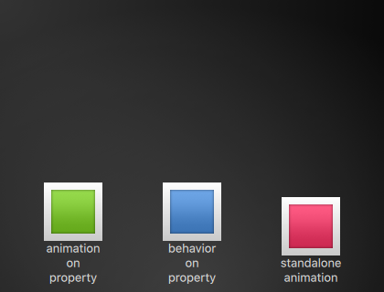
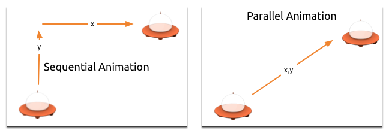
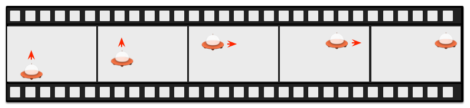

==============
Elementos Fluidos
==============

.. sectionauthor:: `jryannel <https://github.com/jryannel>`_

.. index:: Animations, Easing Curves, Grouped Animations, States, Transitions, SequentialAnimation, ParallelAnimation, ColorAnimation, NumberAnimation, Transition, ClickableImage, Bouncing Ball

.. issues:: ch05

.. note::

    Last Build: |today|

    El código fuente de este capitulo puede ser encontrado en el folder `assets <../../assets>`_.

Hasta aquí hemos visto elementos gráficos simples, como acomodarlos y manipularlos. Este capitulo es acerca de el control de estos cambios en una manera que el valor de la propiedad no solamente cambie instantáneamente, es mas como el valor cambia en el tiempo: una animación. Esta tecnología es una de las llaves fundamentales para interfaces de usuario modernos y como puede ser extendidos con un sistema que describe tu interfaz de usuario usando  usando estados o transiciones. Cada estado define un conjunto de cambios de propiedades y puede ser combinado con animaciones en cambios de estado, llamados transiciones.

Animaciones
==========

.. issues:: ch05

Animaciones son aplicados a cambios de propiedad. Una animación define la curva de interpolación cuando un valor de una propiedad cambia para crear transiciones suaves de un estado a otro. Una animación es definida por una seria de propiedades que son objetivo a animar, una curva de aceleración para la curva de interpolación, y en la mayoría de los casos, una duración. La duración define el tiempo en la que una propiedad cambia. Todas las animaciones en Qt Quick son controladas por un tiempo de muestra, y por ello están sincronizadas. Esto mejora el rendimiento y calidad visual de las animaciones

.. note::

		Animaciones controlan como cambian las propiedades, pro ejemplo, una interpolación de valor. Este es un concepto fundamental. QML esta basado en elementos, propiedades y scripting. Cada elemento provee docenas de propiedades, cada propiedad esta esperando para ser animado por ti. Durante este libro, vas a ver un campo de juego espectacular. Te vas a capturar a ti mismo mirando a algunas animaciones y solamente admirar su belleza, y seguramente también tu genio creativo. Recuerda entonces: *Animaciones controlan cambios de propiedades y cada elemento tiene docenas de propiedades a tu disposición*.
		

    **Libera el poder!**

.. literalinclude:: src/animation/AnimationExample.qml
    :start-after: M1>>
    :end-before: <<M1

El ejemplo de arriba muestra una animación simple aplicada en las propiedades ``x`` y ``rotation``. Cada animación tiene una duración de 4000 mili segundos (msecs) y cicla por siempre. La animación en x mueve la coordenada x del objecto gradualmente hasta 240 px. La animación en rotación corre desde el angulo actual a 360 grados. Ambas animaciones corren en paralelo y empiezas tan rápido como el UI ha sido cargado.

Ahora que has jugado con la animación cambiando las propiedades ``to`` y ``duration`` o puedes agregar otra animación, por ejemplo ``opacity`` o incluso ``scale``. Combinando estos puede parecer que el objeto desaparece en el espacio profundo. Tratalo! 

Elementos de Animación
------------------

.. issues:: ch05
Hay diferentes tipos de elementos de animación, cada uno optimizado para un caso de uso especifico. Aquí hay una lista de las animaciones mas prominentes:

* ``PropertyAnimation`` - Anima cambios en valores de propiedades
* ``NumberAnimation`` - Anima cambios en valores en qreal-type.
* ``ColorAnimation`` - Anima cambios en valores de color.
* ``RotationAnimation`` - Anima cambios en valores de rotación.

Aparte que estos son elementos básicos y ampliamente usados, Qt Quick provee también animaciones mas especializadas para casos específicos de uso:

* ``PauseAnimation`` - Provee una pausa  para una animación.
* ``SequentialAnimation`` - Permite animaciones para ser ejecutadas secuencialmente.
* ``ParallelAnimation`` - Permite animaciones para ser ejecutadas paralelamente.
* ``AnchorAnimation`` - Anima cambios en valores de ancla.
* ``ParentAnimation`` - Anima cambios en valores de padres.
* ``SmoothedAnimation`` - Permite a una propiedad rastrear suavemente un valor.
* ``SpringAnimation`` - Permite a una propiedad rastrear un valor en un movimiento de resorte.
* ``PathAnimation`` - Anima un articulo durante su trayectoria en un camino.
* ``Vector3dAnimation`` - Anima  cambios en un valor QVector3d.

Vamos a aprender después como crear una secuencia de animaciones. Mientras trabajamos en animaciones mas complejas, viene la necesidad de cambiar una propiedad o ejecutar un script durante una animación que esta ejecutándose. Para esto, Qt Quick ofrece un elemento de acción, cual puede ser usado en todo lugar donde otros elementos de animación pueden ser usados:

* ``PropertyAction`` - Especifica cambios de propiedades inmediatos durante animaciones.
* ``ScriptAction`` - Define scripts para ser ejecutados durante una animacion.

Los tipos de animaciones principales van a ser discutidos durante este capitulo usando ejemplo enfocados y pequeños.

Aplicando Animaciones
-------------------

.. issues:: ch05

Animaciones pueden ser aplicados en diferentes maneras:

* *Animaciones en propiedades* - corren automáticamente después de que un elemento ha sido cargado completamente.
* *Comportamientos en propiedad* - corren automáticamente cuando un valor de propiedad cambia.
* *Animacion Standalone* - corren cuando una animación es explícitamente iniciado cuando ``start()`` o ``running`` están establecidos como true (ejemplo, por un enlace de propiedad).

*Después veremos como animaciones pueden ser usados dentro de transacciones de estado*

.. topic:: Version extendida de ClickableImageV2

    Para demostrar el uso de animaciones, re usaremos nuestro componente ``ClickableImage`` del capitulo anterior, y vamos a extenderlo con un elemento de texto.

    .. literalinclude:: src/animation/ClickableImageV2.qml
        :start-after: M1>>
        :end-before: <<M1

		Para organizar los elementos de abajo de la imagen, usamos un posicionador ``Column`` y calculamos el ancho y alto basado en la propiedad ``childrenRect`` de la columna. Exponemos dos propiedades: ``text`` y el ``source`` de la imagen, como también la señal ``clicked``. También queremos que nuestro texto sea tan ancho como la imagen, y que debería envolver. Esto lo logramos usando la propiedad ``wrapMode`` de los elementos ``Text``

    .. note::

				Debido a que la inversión de las dependencias de geometría (la geometría del padre depende de la geometría de los hijos), no podemos establecer un ancho/largo en ``ClickableImageV2``, debido a que esto romperá nuestro enlace de ancho/alto. Esto es una limitación de nuestro diseño interno, y como un diseñador de componentes, tu deberías estar consciente de esto. Normalmente tu deberías preferir que la geometría del hijo dependa de la geometría del padre.

.. rubric:: Los objetos se elevan.

Los tres objetos están en la misma posición y (``y=200``). Ellos necesitan viajar a ``y=40``. Cada uno de ellos usan un método diferente con diferentes rasgos y efectos secundarios.

.. literalinclude:: src/animation/AnimationTypesExample.qml
    :start-after: M1>>
    :end-before: <<M1

.. rubric:: 1st object

El primer objeto viaja usando la estrategia de ``Animation on <property>``. La animación empieza inmediatamente. Cuando un objeto es presionado sus posiciones y son reiniciados con la posición de comienzo, esto aplica a todos los objetos. En el primer objeto, el reinicio no tiene ningún efecto mientras la animación se esta ejecutando. Es algo perturbador ya que la posición es establecida en fracciones de segundo a un nuevo valor antes de que la animación empiece * Tales cambios de propiedades deberán ser evitados*

.. literalinclude:: src/animation/AnimationTypesExample.qml
    :start-after: M2>>
    :end-before: <<M2

.. rubric:: 2nd object

El segundo objeto viaja usando la animación ``behaviour on``. Este comportamiento se comunica con la propiedad del objeto, cada vez que hay un cambio en la propiedad, cambia a través de esta animación. El comportamiento  puede ser deshabilitado usando ``enabled: false`` en el elemento ``Behaviour``. El objeto empezara a viajar cuando lo presiones (posición y es entonces puesto en 40). Otro click no tiene efecto en la posición que ya fue establecida. Puedes tratar de usar un valor aleatorio (ejemplo, 40+(Math.random()*(205-40)``) para la posición y. Tu puedes ver que el objeto siempre se anima para la nueva posición y adapta su velocidad para igualar los 4 segundo del destino definido por la duración de la animación.

.. literalinclude:: src/animation/AnimationTypesExample.qml
    :start-after: M3>>
    :end-before: <<M3

.. rubric:: 3rd object

El tercer objeto usa una ``animacion standalone``. La animación es definida como su propio elemento y puede estar en cualquier lugar en el documento. El click va a comenzar cuando la animación use la función de animación ``start()``.Cada animación tiene funciones start(), stop(), resume(), y restart(). La animación en si contiene mucho mas información que las otras animaciones anteriores. Nosotros necesitamos definir el objetivo y propiedades a declarar en el elemento objetivo para ser animado, y que elementos queremos animar. Necesitamos definir un valor ``to`` y en este caso definimos también un valor ``from`` para permitir reiniciar la animación.

Un click en el fondo reiniciara todos los objetos a su posición inicial. El primer objeto no puede ser reiniciado sin tener que reiniciar el programa, cual dispara la recarga de los elementos.

.. note::
		Otra manera de iniciar/detener una animación es enlazando una propiedad con la propiedad ``running`` de la animación. Esto es especialmente importante cuando la entrada de usuario es en el control de propiedades::

        NumberAnimation {
            ...
            // Animacion inicia cuando se presiona el raton
            running: area.pressed
        }
        MouseArea {
            id: area
        }

Easing Curves
-------------

.. issues:: ch05

The value change of a property can be controlled by an animation. Easing attributes allows influencing the interpolation curve of a property change. All animations we have defined by now use a linear interpolation because the initial easing type of an animation is ``Easing.Linear``. It's best visualized with a small plot, where the y-axis is the property to be animated and the x-axis is the time (*duration*). A linear interpolation would draw a straight line from the ``from`` value at the start of the animation to the ``to`` value at the end of the animation. So the easing type defines the curve of change. Easing types are carefully chosen to support a natural fit for a moving object, for example when a page slides out. Initially the page should slide out slowly and then gaining the speed to finally slide out on high speed, similar to turning the page of a book.

.. note::

    Animations should not be overused. As other aspects of UI design also animations should be designed carefully and support the UI flow and not dominate it. The eye is very sensitive to moving objects and animations can easily distract the user.

In the next example we will try some easing curves. Each easing curve is displayed by a click-able image and, when clicked, will set a new easing type on the ``square`` animation and then trigger a ``restart()`` to run the animation with the new curve.

.. figure:: assets/automatic/easingcurves.png
    :scale: 50%

The code for this example was made a little bit more complicated.We first create a grid of ``EasingTypes`` and a ``Box`` which is controlled by the easing types. A easing type just displays the curve which the box shall use for its animation. When the user clicks on an easing curve the box moves in a direction according to the easing curve. The animation itself is a standalone-animation with the target set to the box and configured for x-property animation with a duration of 2 secs.

.. note:: The internals of the EasingType renders the curve in real time and the interested reader can look it up in the ``EasingCurves`` example.

.. literalinclude:: src/EasingCurves/EasingCurves.qml
    :start-after: M1>>
    :end-before: <<M1

A you play with it, please observe the change of speed during an animation. Some animations feel more natural for the object and some feel irritating.

Besides the ``duration`` and ``easing.type`` you are able to fine tune animations. For example the general ``PropertyAnimation`` where most animation inherit from additionally supports an ``easing.amplitude``, ``easing.overshoot`` and ``easing.period`` property which allows you to fine-tune the behavior of particular easing curves. Not all easing curves support these parameters. Please consult the :qt5r:`easing table <qml-qtquick-propertyanimation.html#easing-prop>` from the ``PropertyAnimation`` documentation to check if an easing parameter has influence on an easing curve.

.. note::

    Choosing the right animation for the element in the user interface context is crucial for the outcome. Remember the animation shall support the UI flow; not irritate the user.

Grouped Animations
------------------

.. issues:: ch05

Often animations will be more complex then just animating one property. You might want to run several animations at the same time or one after another or even execute a script between two animations. For this, the grouped animation offer you a possibility. As the named suggests it's possible to group animations. Grouping can be done in two ways: parallel or sequential. You can use the ``SequentialAnimation`` or the ``ParallelAnimation`` element, which act as animation containers for other animation elements. These grouped animations are animations themselves and can be used exactly as such.

All direct child animations of a parallel animation will run in parallel, when started. This allows you to animate different properties at the same time.

.. literalinclude:: src/animation/ParallelAnimationExample.qml
    :start-after: M1>>
    :end-before: <<M1

.. figure:: assets/parallelanimation_sequence.png

A sequential animation will first run the first child animation and then continue from there.

.. literalinclude:: src/animation/SequentialAnimationExample.qml
    :start-after: M1>>
    :end-before: <<M1

Grouped animation can also be nested, for example a sequential animation can have two parallel animations as child animations, and so on. We can visualize this with a soccer ball example. The idea is to throw a ball from left to right an animate its behavior.

.. figure:: assets/soccer_init.png

To understand the animation we need to dissect it into the integral transformations of the object. We need to remember animation do animate property changes. Here are the different transformations:

* An x-translation from left-to-right (``X1``)
* An y-translation from down to up (``Y1``) followed by a translation from up to down (``Y2``) with some bouncing
* A rotation over 360 over the whole animation duration (``ROT1``)

The whole duration of the animation should take three seconds.

.. figure:: assets/soccer_plan.png

We start with an empty item as root element of the width of 480 and height of 300.

.. code-block:: js

    import QtQuick 2.5

    Item {
        id: root
        width: 480
        height: 300
        property int duration: 3000

        ...
    }

We have defined our total animation duration as reference to better synchronize the animation parts.

The next step would be to add the background, which in our case are 2 rectangles with a green and blue gradients.

.. literalinclude:: src/animation/BouncingBallExample.qml
    :start-after: M1>>
    :end-before: <<M1

.. figure:: assets/soccer_stage1.png

The upper blue rectangle takes 200 pixel of the height and the lower one is anchored to the top on the sky and to the bottom on the root element.

Let's bring the soccer ball onto the green. The ball is an image, stored under "assets/soccer_ball.png". For the beginning we would like to position it in the lower left corner, near the edge.

.. literalinclude:: src/animation/BouncingBallExample.qml
    :start-after: M2>>
    :end-before: <<M2

.. figure:: assets/soccer_stage2.png

The image has a mouse area attached to it. If the ball is clicked the position of the ball will reset and the animation restarted.

Let's start with an sequential animation for the two y translations first.

.. code-block:: js

    SequentialAnimation {
        id: anim
        NumberAnimation {
            target: ball
            properties: "y"
            to: 20
            duration: root.duration * 0.4
        }
        NumberAnimation {
            target: ball
            properties: "y"
            to: 240
            duration: root.duration * 0.6
        }
    }

.. figure:: assets/soccer_stage3.png

This specifies that 40% of the total animation duration is the up animation and 60% the down animation. One animation after another as a sequence. The transformations are animated on a linear path but there is no curve currently. Curves will be added later using the easing curves, at the moment we're concentrating on getting the transformations animated.

Next, we need to add the x-translation. The x-translation shall run in parallel with the y-translation so we need to encapsulate the sequence of y-translations into a parallel animation together with the x-translation.

.. code-block:: js

    ParallelAnimation {
        id: anim
        SequentialAnimation {
            // ... our Y1, Y2 animation
        }
        NumberAnimation { // X1 animation
            target: ball
            properties: "x"
            to: 400
            duration: root.duration
        }
    }

At the end we would like the ball to be rotating. For this we need to add another animation to the parallel animation. We choose the ``RotationAnimation`` as it's specialized for rotation.

.. code-block:: js

    ParallelAnimation {
        id: anim
        SequentialAnimation {
            // ... our Y1, Y2 animation
        }
        NumberAnimation { // X1 animation
            // X1 animation
        }
        RotationAnimation {
            target: ball
            properties: "rotation"
            to: 720
            duration: root.duration
        }
    }

That's the whole animation sequence. The one thing left is to provide the correct easing curves for the movements of the ball. For the *Y1* animation I use a ``Easing.OutCirc`` curve as this should look more like a circular movement. *Y2* is enhanced using an ``Easing.OutBounce`` as the ball should bounce and the bouncing should happen at the end (try an ``Easing.InBounce`` and you see the bouncing will start right away).
The *X1* and *ROT1* animation are left as is with a linear curve.

Here is the final animation code for your reference:

.. literalinclude:: src/animation/BouncingBallExample.qml
    :start-after: M3>>
    :end-before: <<M3

States and Transitions
======================

.. issues:: ch05

Often parts of a user interface can be described in states. A state defines a set of property changes and can be triggered by a certain condition. Additional these state switches can have a transition attached which defines how these changes should be animated or any additional actions shall be applied. Actions can also be applied when a state is entered.

States
------

.. issues:: ch05

You define states in QML with the ``State`` element, which needs to be bound to the ``states`` array of any item element. A state is identified through a state name and consist, in its simplest form, of a series of property changes on elements. The default state is defined by the initial properties of the element and is named ``""`` (the empty string).

.. code-block:: js

    Item {
        id: root
        states: [
            State {
                name: "go"
                PropertyChanges { ... }
            },
            State {
                name: "stop"
                PropertyChanges { ... }
            }
        ]
    }

A state is changed by assigning a new state name to the ``state`` property of the element with the states defined.

.. note::

    Another way to switch states is using the ``when`` property of the ``State`` element. The ``when`` property can be set to an expression that evaluates to true when the state should be applied.

.. code-block:: js

    Item {
        id: root
        states: [
            ...
        ]

        Button {
            id: goButton
            ...
            onClicked: root.state = "go"
        }
    }

.. figure:: assets/trafficlight_sketch.png

For example, a traffic light might have two signaling lights. The upper one signaling stop with a red color and the lower one signaling go with a green color. In this example both lights should not shine at the same time. Let's have a look at the state chart diagram.

.. figure:: assets/trafficlight_states.png

When the system is switched on it goes automatically into the stop mode as default state. The stop state changes the ``light1`` to red and ``light2`` to black (off). An external event can now trigger a state switch to the ``"go"`` state. In the go state we change the color properties from ``light1`` to black (off) and ``light2`` to green to indicate the passers may walk now.

To realize this scenario we start sketching our user interface for the 2 lights. For simplicity we use 2 rectangles with the radius set to the half of the width (and the width is the same as the height, which means it's a square).

.. literalinclude:: src/animation/StatesExample.qml
    :start-after: M1>>
    :end-before: <<M1

As defined in the state chart we want to have two states one the ``"go"`` state and the other the ``"stop"`` state, where each of them changes the traffic lights respective to red or green. We set the ``state`` property to ``stop`` to ensure the initial state of our traffic light is the ``stop`` state.

.. note::

    We could have achieved the same effect with only a ``"go"`` state and no explicit ``"stop"`` state by setting the color of ``light1`` to red and the color of ``light2`` to black. The initial state ``""`` defined by the initial property values would then act as the ``"stop"`` state.

.. literalinclude:: src/animation/StatesExample.qml
    :start-after: M2>>
    :end-before: <<M2

Using ``PropertyChanges { target: light2; color: "black" }`` is not really required in this examples as the initial color of ``light2`` is already black. In a state it's only necessary to describe how the properties shall change from their default state (and not from the previous state).

A state change is triggered using a mouse area which covers the whole traffic light and toggles between the go and stop state when clicked.

.. literalinclude:: src/animation/StatesExample.qml
    :start-after: M3>>
    :end-before: <<M3

.. figure:: assets/trafficlight_ui.png

We are now able to successfully change the state of the traffic lamp. To make the UI more appealing and look natural we should add some transitions with animation effects. A transition can be triggered by a state change.

.. note::

    It's possible to create a similar logic using scripting instead of QML states. Developers can easily fall into the trap of writing more a JavaScript program than a QML program.

Transitions
-----------

.. issues:: ch05

A series of transitions can be added to every item. A transition is executed by a state change. You can define on which state change a particular transition can be applied using the ``from:`` and ``to:`` properties. These two properties act like a filter, when the filter is true the transition will be applied. You can also use the wild-cast "*" which means "any state". For example ``from:"*"; to:"*"`` means from any state to any other state and is the default value for ``from`` and ``to``, which means the transition is applied to every state switch.

For this example we would like to animate the color changes when switching state from "go" to "stop". For the other reversed state change ("stop" to "go") we want to keep an immediate color change and don't apply a transition. We restrict the transition with the ``from`` and ``to`` properties to filter only the state change from "go" to "stop". Inside the transition we add two color animations for each light, which shall animate the property changes defined in the state description.

.. literalinclude:: src/animation/StatesExample.qml
    :start-after: M4>>
    :end-before: <<M4

You can change the state though clicking the UI. The state is applied immediately and will also change the state while a transition is running. So try to click the UI while the state is in transition from "stop" to "go". You will see the change will happen immediately.

.. figure:: assets/trafficlight_transition.png

You could play around with this UI by, for example, scaling the inactive light down to highlight the active light. For this you would need to add another property change for scaling to the states and also handle the animation for the scaling property in the transition. Another option would be to add an "attention" state where the lights are blinking yellow. For this, you would need to add a sequential animation to the transition for one second going to yellow ("to" property of the animation and one sec going to "black"). Maybe you would also want to change the easing curve to make it more visually appealing.

Advanced Techniques
===================

.. issues:: ch05

.. todo:: To be written
