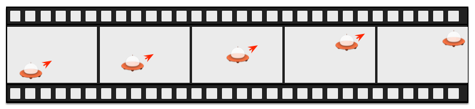

==============
Elementos Fluidos
==============

.. sectionauthor:: `jryannel <https://github.com/jryannel>`_

.. index:: Animations, Easing Curves, Grouped Animations, States, Transitions, SequentialAnimation, ParallelAnimation, ColorAnimation, NumberAnimation, Transition, ClickableImage, Bouncing Ball

.. issues:: ch05

.. note::

    Last Build: |today|

    El código fuente de este capitulo puede ser encontrado en el folder `assets <../../assets>`_.

Hasta aquí hemos visto elementos gráficos simples, como acomodarlos y manipularlos. Este capitulo es acerca de el control de estos cambios en una manera que el valor de la propiedad no solamente cambie instantáneamente, es mas como el valor cambia en el tiempo: una animación. Esta tecnología es una de las llaves fundamentales para interfaces de usuario modernos y como puede ser extendidos con un sistema que describe tu interfaz de usuario usando  usando estados o transiciones. Cada estado define un conjunto de cambios de propiedades y puede ser combinado con animaciones en cambios de estado, llamados transiciones.

Animaciones
==========

.. issues:: ch05

Animaciones son aplicados a cambios de propiedad. Una animación define la curva de interpolación cuando un valor de una propiedad cambia para crear transiciones suaves de un estado a otro. Una animación es definida por una seria de propiedades que son objetivo a animar, una curva de aceleración para la curva de interpolación, y en la mayoría de los casos, una duración. La duración define el tiempo en la que una propiedad cambia. Todas las animaciones en Qt Quick son controladas por un tiempo de muestra, y por ello están sincronizadas. Esto mejora el rendimiento y calidad visual de las animaciones

.. note::

		Animaciones controlan como cambian las propiedades, pro ejemplo, una interpolación de valor. Este es un concepto fundamental. QML esta basado en elementos, propiedades y scripting. Cada elemento provee docenas de propiedades, cada propiedad esta esperando para ser animado por ti. Durante este libro, vas a ver un campo de juego espectacular. Te vas a capturar a ti mismo mirando a algunas animaciones y solamente admirar su belleza, y seguramente también tu genio creativo. Recuerda entonces: *Animaciones controlan cambios de propiedades y cada elemento tiene docenas de propiedades a tu disposición*.
		

    **Libera el poder!**

.. figure:: assets/animation_sequence.png

.. literalinclude:: src/animation/AnimationExample.qml
    :start-after: M1>>
    :end-before: <<M1

El ejemplo de arriba muestra una animación simple aplicada en las propiedades ``x`` y ``rotation``. Cada animación tiene una duración de 4000 mili segundos (msecs) y cicla por siempre. La animación en x mueve la coordenada x del objecto gradualmente hasta 240 px. La animación en rotación corre desde el angulo actual a 360 grados. Ambas animaciones corren en paralelo y empiezas tan rápido como el UI ha sido cargado.

Ahora que has jugado con la animación cambiando las propiedades ``to`` y ``duration`` o puedes agregar otra animación, por ejemplo ``opacity`` o incluso ``scale``. Combinando estos puede parecer que el objeto desaparece en el espacio profundo. Tratalo! 

Elementos de Animación
------------------

.. issues:: ch05
Hay diferentes tipos de elementos de animación, cada uno optimizado para un caso de uso especifico. Aquí hay una lista de las animaciones mas prominentes:

* ``PropertyAnimation`` - Anima cambios en valores de propiedades
* ``NumberAnimation`` - Anima cambios en valores en qreal-type.
* ``ColorAnimation`` - Anima cambios en valores de color.
* ``RotationAnimation`` - Anima cambios en valores de rotación.

Aparte que estos son elementos básicos y ampliamente usados, Qt Quick provee también animaciones mas especializadas para casos específicos de uso:

* ``PauseAnimation`` - Provee una pausa  para una animación.
* ``SequentialAnimation`` - Permite animaciones para ser ejecutadas secuencialmente.
* ``ParallelAnimation`` - Permite animaciones para ser ejecutadas paralelamente.
* ``AnchorAnimation`` - Anima cambios en valores de ancla.
* ``ParentAnimation`` - Anima cambios en valores de padres.
* ``SmoothedAnimation`` - Permite a una propiedad rastrear suavemente un valor.
* ``SpringAnimation`` - Permite a una propiedad rastrear un valor en un movimiento de resorte.
* ``PathAnimation`` - Anima un artículo durante su trayectoria en un camino.
* ``Vector3dAnimation`` - Anima  cambios en un valor QVector3d.

Vamos a aprender después como crear una secuencia de animaciones. Mientras trabajamos en animaciones mas complejas, viene la necesidad de cambiar una propiedad o ejecutar un script durante una animación que esta ejecutándose. Para esto, Qt Quick ofrece un elemento de acción, cual puede ser usado en todo lugar donde otros elementos de animación pueden ser usados:

* ``PropertyAction`` - Especifica cambios de propiedades inmediatos durante animaciones.
* ``ScriptAction`` - Define scripts para ser ejecutados durante una animacion.

Los tipos de animaciones principales van a ser discutidos durante este capitulo usando ejemplo enfocados y pequeños.

Aplicando Animaciones
-------------------

.. issues:: ch05

Animaciones pueden ser aplicados en diferentes maneras:

* *Animaciones en propiedades* - corren automáticamente después de que un elemento ha sido cargado completamente.
* *Comportamientos en propiedad* - corren automáticamente cuando un valor de propiedad cambia.
* *Animacion Standalone* - corren cuando una animación es explícitamente iniciado cuando ``start()`` o ``running`` están establecidos como true (ejemplo, por un enlace de propiedad).

*Después veremos como animaciones pueden ser usados dentro de transacciones de estado*

.. topic:: Version extendida de ClickableImageV2

    Para demostrar el uso de animaciones, re usaremos nuestro componente ``ClickableImage`` del capitulo anterior, y vamos a extenderlo con un elemento de texto.

    .. literalinclude:: src/animation/ClickableImageV2.qml
        :start-after: M1>>
        :end-before: <<M1

		Para organizar los elementos de abajo de la imagen, usamos un posicionador ``Column`` y calculamos el ancho y alto basado en la propiedad ``childrenRect`` de la columna. Exponemos dos propiedades: ``text`` y el ``source`` de la imagen, como también la señal ``clicked``. También queremos que nuestro texto sea tan ancho como la imagen, y que debería envolver. Esto lo logramos usando la propiedad ``wrapMode`` de los elementos ``Text``

    .. note::

				Debido a que la inversión de las dependencias de geometría (la geometría del padre depende de la geometría de los hijos), no podemos establecer un ancho/largo en ``ClickableImageV2``, debido a que esto romperá nuestro enlace de ancho/alto. Esto es una limitación de nuestro diseño interno, y como un diseñador de componentes, tu deberías estar consciente de esto. Normalmente tu deberías preferir que la geometría del hijo dependa de la geometría del padre.

.. rubric:: Los objetos se elevan.

.. figure:: assets/animationtypes_start.png

Los tres objetos están en la misma posición y (``y=200``). Ellos necesitan viajar a ``y=40``. Cada uno de ellos usan un método diferente con diferentes rasgos y efectos secundarios.

.. literalinclude:: src/animation/AnimationTypesExample.qml
    :start-after: M1>>
    :end-before: <<M1

.. rubric:: 1st object

El primer objeto viaja usando la estrategia de ``Animation on <property>``. La animación empieza inmediatamente. Cuando un objeto es presionado sus posiciones y son reiniciados con la posición de comienzo, esto aplica a todos los objetos. En el primer objeto, el reinicio no tiene ningún efecto mientras la animación se esta ejecutando. Es algo perturbador ya que la posición es establecida en fracciones de segundo a un nuevo valor antes de que la animación empiece * Tales cambios de propiedades deberán ser evitados*

.. literalinclude:: src/animation/AnimationTypesExample.qml
    :start-after: M2>>
    :end-before: <<M2

.. rubric:: 2nd object

El segundo objeto viaja usando la animación ``behaviour on``. Este comportamiento se comunica con la propiedad del objeto, cada vez que hay un cambio en la propiedad, cambia a través de esta animación. El comportamiento  puede ser deshabilitado usando ``enabled: false`` en el elemento ``Behaviour``. El objeto empezara a viajar cuando lo presiones (posición y es entonces puesto en 40). Otro click no tiene efecto en la posición que ya fue establecida. Puedes tratar de usar un valor aleatorio (ejemplo, 40+(Math.random()*(205-40)``) para la posición y. Tu puedes ver que el objeto siempre se anima para la nueva posición y adapta su velocidad para igualar los 4 segundo del destino definido por la duración de la animación.

.. literalinclude:: src/animation/AnimationTypesExample.qml
    :start-after: M3>>
    :end-before: <<M3

.. rubric:: 3rd object

El tercer objeto usa una ``animacion standalone``. La animación es definida como su propio elemento y puede estar en cualquier lugar en el documento. El click va a comenzar cuando la animación use la función de animación ``start()``.Cada animación tiene funciones start(), stop(), resume(), y restart(). La animación en si contiene mucho mas información que las otras animaciones anteriores. Nosotros necesitamos definir el objetivo y propiedades a declarar en el elemento objetivo para ser animado, y que elementos queremos animar. Necesitamos definir un valor ``to`` y en este caso definimos también un valor ``from`` para permitir reiniciar la animación.

.. figure:: assets/animationtypes.png

Un click en el fondo reiniciara todos los objetos a su posición inicial. El primer objeto no puede ser reiniciado sin tener que reiniciar el programa, cual dispara la recarga de los elementos.

.. note::
		Otra manera de iniciar/detener una animación es enlazando una propiedad con la propiedad ``running`` de la animación. Esto es especialmente importante cuando la entrada de usuario es en el control de propiedades::

        NumberAnimation {
            ...
            // Animacion inicia cuando se presiona el raton
            running: area.pressed
        }
        MouseArea {
            id: area
        }

Curvas de Aceleracion
-------------

.. issues:: ch05

El valor de los cambios de propiedades puede ser controlado por una animación. Atributos de aceleración permiten influir en la curva de interpolación de un cambio de propiedad. Todas animaciones que hemos definido por ahora usan un interpolacion lineal porque el tipo de aceleración inicial de una animación es ``Easing.linear``. Es mejor visualizado con un pequeño grafico, donde el eje y es la propiedad para animar y el eje x es el tiempo (*duration*). Una interpolación lineal puede ser dibujado con una linea recta desde el valor del inicio de la animación``from`` al valor de la final de la animación ``to`. Entonces el tipo de aceleración define la curva de cambio. Tipos de aceleración son cuidadosamente escogidos para soportar un ajuste natural para un objeto móvil, por ejemplo, cuando una pagina se desliza hacia afuera, inicialmente la pagina  deberá deslizarse lentamente y luego ganando velocidad para al final salir a la mayor velocidad, similar a hojear una pagina de un libro.

.. note::
		Animaciones no deberán ser sobre usados. Como otro aspecto de disenso de UI, las animaciones deberán ser diseñados cuidadosamente y soportar el flujo de UI y no dominarlo. El ojo es muy sensible en objetos móviles, y animaciones pueden fácilmente distraer el usuario.
		
En el siguiente ejemplo, vamos a probar algunas curvas de aceleración. Cada curva de aceleración es mostrado por una imagen clickeable y, cuando es presionado, va a establecer un nuevo tipo de aceleración en la animación ``square``, entonces disparando un ``restart()`` para correr la animación con la nueva curva.

.. figure:: assets/automatic/easingcurves.png
    :scale: 50%

El código de este ejemplo fue hecho un poco mas complicado. Primero creamos una cuadricula de ``EasingTypes``, y un ``Box`` cual es controlado con los tipos de aceleración. Un tipo de aceleración solo muestra la curva en la que la caja deberá usar su animación. Cuando el usuario presiona en una curva de aceleración, la caja se mueve en una dirección acordada en la curva de aceleración. La animación en si es una animación standalone con un establecimiento de objetivo de la caja y configurada con animaciones en la propiedad x con una duración de 2 segundos.

.. note:: Las partes internas de EasingType renderizan la curva en tiempo real, y si el lector esta interesado, puede ver como funciona con el ejemplo de ``EasingCurves``

.. literalinclude:: src/EasingCurves/EasingCurves.qml
    :start-after: M1>>
    :end-before: <<M1

Como tu juegas con el ejemplo, observa los cambios de velocidad durante la animación. Algunas animaciones se sienten naturales para el objeto y otros se sienten irritantes.

Aparte de ``duration`` y ``easing.type``, tu puedes afinar las animaciones. Por ejemplo, ``PropertyAnimation``, donde la mayoría de animaciones heredan para soportar propiedades adicionales como ``easing.amplitude``, ``easing.overshoot``, y ``easing.period``;que te permiten afinar el comportamiento de una curva de aceleración particular. No todas las curvas de aceleración soportan estos parámetros. Consulta el :qt5r:`easing table <qml-qtquick-propertyanimation.html#easing-prop>` desde la documentación de ``PropertyAnimation`` para observar si el parámetro de aceleración tiene influencia en una curva de aceleración.

.. note::
		Escogiendo la animación correcta para un elemento en un contexto de interfaz de usuario es crucial para el una buena aceptación. Recuerda de las animaciones deben de soportar el flujo de UI; no irritar al usuario.

Animaciones Agrupadas
------------------

.. issues:: ch05

Normalmente, animaciones son mas complejos que solo animar una sola propiedad. Tu puedes querer ejecutar varias animaciones en el mismo tiempo o uno después de otro, o inclusive ejecutar un guion  entre dos animaciones. Para esto, la animación agrupada te ofrece esas posibilidades. Como el nombre indica, es posible agrupar animaciones. Agrupacion puede ser hecho en dos maneras: paralelamente o secuencialmente. Puedes usar los elementos ``SequentialAnimation`` o ``ParallelAnimation``, cuales actúan como contenedores de animaciones para otros elementos de animación. Este grupo de animación son animaciones por si mismos, y pueden ser usados exactamente así.

.. figure:: assets/groupedanimation.png

Toda animación hija directa de una animación paralela puede correr en paralelo, cuando comienza el contenedor. Esto permite animar diferentes propiedades al mismo tiempo..

.. literalinclude:: src/animation/ParallelAnimationExample.qml
    :start-after: M1>>
    :end-before: <<M1

Una animacion secuencial primero correra el primer animacion hijo, y despues continuara con los demas en ese orden.

.. literalinclude:: src/animation/SequentialAnimationExample.qml
    :start-after: M1>>
    :end-before: <<M1

.. figure:: assets/sequentialanimation_sequence.png

Animaciones agrupadas pueden ser también anidados, por ejemplo una animación secuencial puede tener dos animaciones paralelas como animaciones hijas, y así. Podemos visualizar esto con un ejemplo de un balón de futbol. La idea es aventar el balón de izquierda a derecha y animar su comportamiento.

.. figure:: assets/soccer_init.png

* Una traslación en x de izquierda a derecha (``X1``)
* Una traslación de y de abajo para arriba (``Y1``) seguido por una traslación de arriba para abajo (``Y2``) con cierto rebote.
* Una rotación en 360 grados durante toda la duración de la animación (``ROT1``)

La duración completa de la animación deberá durar 3 segundos.

.. figure:: assets/soccer_plan.png

Podemos empezar con un artículo vació como elemento base de ancho de 480 y alto de 300.

.. code-block:: js

    import QtQuick 2.5

    Item {
        id: root
        width: 480
        height: 300
        property int duration: 3000

        ...
    }

Hemos definido una duración total de animación como referencia para mejor sincronización de las partes de la animación.

El siguiente paso es agregar el fondo, cual en este caso serán 2 rectángulos con gradientes verdes y azules.

.. literalinclude:: src/animation/BouncingBallExample.qml
    :start-after: M1>>
    :end-before: <<M1

.. figure:: assets/soccer_stage1.png

El rectangulo superior azul toma 200 pixeles del alto y el rectangulo de abajo esta anclado de arriba por el cielo y Hay que traer el balón de futbol en la parte verde. El balón es una imagen, guardada dentro de "assets/soccer_ball.png". Para el inicio, nosotros queremos posicionarlo en la esquina de izquierda-abajo, cerca del limite.

.. literalinclude:: src/animation/BouncingBallExample.qml
    :start-after: M2>>
    :end-before: <<M2

.. figure:: assets/soccer_stage2.png

La imagen tiene una área de ratón agregada a el. Si el balón es presionado, la posición del balón sera reiniciado, y la animación se reiniciara.

Vamos a comenzar con la animación secuencial para las primeras 2 traslaciones.

.. code-block:: js

    SequentialAnimation {
        id: anim
        NumberAnimation {
            target: ball
            properties: "y"
            to: 20
            duration: root.duration * 0.4
        }
        NumberAnimation {
            target: ball
            properties: "y"
            to: 240
            duration: root.duration * 0.6
        }
    }

Esto especifica que 40% de la duración total de la animación es en la parte de arriba y el 60% estará abajo. Una animación después de otra como secuencia. Las transformaciones son animadas en una ruta lineal, pero no todavía no hay curvas. Curvas son añadidas después cuando usemos curvas de aceleración, por el momento nos concentraremos en tener las transformaciones animadas..

Después, necesitamos agregar la traslación en x. La traslación en x deberá correr en paralelo con la traslación en y, pues necesitamos encapsular la secuencias de traslaciones en y dentro de una animación en paralelo con la traslación en x.

.. code-block:: js

    ParallelAnimation {
        id: anim
        SequentialAnimation {
            // ... our Y1, Y2 animation
        }
        NumberAnimation { // X1 animation
            target: ball
            properties: "x"
            to: 400
            duration: root.duration
        }
    }

.. figure:: assets/soccer_stage4.png

En el final, queremos un balón que rote. Para hacer esto, necesitamos agregar otra animación en la animación paralelos. Escogemos la ``RotationAnimation`` ya que esta especializada en rotaciones.

.. code-block:: js

    ParallelAnimation {
        id: anim
        SequentialAnimation {
            // ... our Y1, Y2 animation
        }
        NumberAnimation { // X1 animation
            // X1 animation
        }
        RotationAnimation {
            target: ball
            properties: "rotation"
            to: 720
            duration: root.duration
        }
    }

Este es la completa secuencia de animaciones. La faltante es proveer unas curvas de aceleración correctas para los movimientos del balón. Para la animación *Y1* usamos la curva ``Easing.OutCirc`` como deberá verse como un movimiento circular. *Y2* es mejorado usando ``Easing.OutBounce`` ya que el balón deberá rebotar y el rebote deberá pasar al final (trata un ``Easing.InBounce`` y veras que el rebote empezara al final).

Las animaciones *X1* y *ROT1* llevan curva lineal.

Aquí esta el código de la animación final como tu referencia.

.. literalinclude:: src/animation/BouncingBallExample.qml
    :start-after: M3>>
    :end-before: <<M3

Transaciones y Estados
======================

.. issues:: ch05

Partes normales de un interfaz de usuario pueden ser descritos como estados. Un estado define un conjunto de cambios de propiedades y puede ser disparado por cierta condición. Adicionalmente, estos cambios de estados pueden tener una transacción añadida, cual define como estos cambios deberán ser animados o cualquier otra acción adicional que deberá ser aplicada. Acciones pueden ser aplicada cuando un estado entra.

Estados
------

.. issues:: ch05

To defines estados en QML con el elemento ``State`, que necesida ser conectado con el arreglo de ``states`` de un artículo. Un estado es identificado a travez de un nombre de estado, y consiste en su forma mas simple, en una serie de cambios de propiedades en elementos. El estado por defento es definido por las propiedades iniciales de un elemento y es llamado ``""`` (una cadena vacia).

Para definir estados en QML con el elemento ``State`, que necesita ser conectado con el arreglo de ``states`` de un artículo. Un estado es identificado a través de un nombre de estado, y consiste en su forma mas simple, en una serie de cambios de propiedades en elementos. El estado por defecto es definido por las propiedades iniciales de un elemento y es llamado ``""`` (una cadena vaciá).

.. code-block:: js

    Item {
        id: root
        states: [
            State {
                name: "go"
                PropertyChanges { ... }
            },
            State {
                name: "stop"
                PropertyChanges { ... }
            }
        ]
    }

Un estado es cambiado asignando un nuevo nombre de estado en la propiedad ``state`` del elemento en la que los estados están definidos.

.. note::

		Otra forma de cambiar estados es usando la propiedad ``when`` en el elemento ``State``. La propiedad ``when`` puede ser establecido como una expresión que evaluá la verdad cuando el estado deberá ser aplicado.

.. code-block:: js

    Item {
        id: root
        states: [
            ...
        ]

        Button {
            id: goButton
            ...
            onClicked: root.state = "go"
        }
    }

Por ejemplo, un semáforo puede tener dos luces de señal. El de arriba señala parar con un color rojo, y el de abajo señala un seguir como un color verde. En este ejemplo, las dos luces no deberán de encender al mismo tiempo. Entonces veamos el diagrama de estados.

.. figure:: assets/trafficlight_states.png

Cuando el sistema cambia, va automáticamente dentro del modo de parar como  un estado por defecto. El estado parar cambia el ``light1`` a rojo y ``light2`` a negro (apagado). Un evento externo puede disparar el cambio de estado en el estado ``”go”``. En este estado, cambiamos la propiedad de color de ``light`` a negro (off) y ``light2`` a verde que indica que los transeúntes pueden caminar.

Para realizar este escenario, empezaremos diseñando nuestra interfaz de usuario de las 2 luces. Para simplificar, usaremos 2 rectángulos con el radio establecido a la mitad del ancho (y el ancho es el mismo que la altura, que indica que es un cuadrado.

.. literalinclude:: src/animation/StatesExample.qml
    :start-after: M1>>
    :end-before: <<M1

Como esta definido en el grafo de estados, queremos tener dos estados, el estado ``”go”`` y el otro estado ``”stop”``, donde cada uno de ellos cambian el semáforo respectivamente a rojo o verde. Establecemos la propiedad ``state`` a ``stop`` para asegurar que el estado inicial de nuestro semáforo es el estado ``stop``.

.. note::

		Pudimos haber obtenido el mismo efecto con solo un estado ``”go”`` y no explícitamente el estado ``”stop”`` estableciendo el color de ``light1`` a rojo y el color de ``light2`` a negro. El estado inicial ``””`` definido por los valores de las propiedades iniciales podría entonces actuar como el estado ``”stop”``.

.. literalinclude:: src/animation/StatesExample.qml
    :start-after: M2>>
    :end-before: <<M2

Usando ``PropertyChanges {target: light2; color: “black”}`` no es realmente necesario en este ejemplo ya que el color inicial de ``light2`` es negro. En un estado, solamente es necesario describir como las propiedades deberán de cambiar desde su estado por defecto (y no desde su estado anterior).

Un cambio de estado es disparado usando el área de ratón, cual cubre todo el semáforo y alterna entre los estados siga y pare cuando es presionado.

.. literalinclude:: src/animation/StatesExample.qml
    :start-after: M3>>
    :end-before: <<M3

.. figure:: assets/trafficlight_ui.png

Ahora podemos cambiar satisfactoriamente el estado del semáforo. Para hacer el UI mas atractivo y natural, deberíamos agregar algunas transacciones con efectos de animación. Una transición que puede ser disparada por un cambio de estado.

.. note::

			Es posible el crear una lógica similar usando scripting en vez de estados QML. Desarrolladores pueden fácilmente caer dentro de la trampa de escribir mas programas JavaScript que programas QML.

Transiciones
-----------

.. issues:: ch05

A series of transitions can be added to every item. A transition is executed by a state change. You can define on which state change a particular transition can be applied using the ``from:`` and ``to:`` properties. These two properties act like a filter, when the filter is true the transition will be applied. You can also use the wild-cast "*" which means "any state". For example ``from:"*"; to:"*"`` means from any state to any other state and is the default value for ``from`` and ``to``, which means the transition is applied to every state switch.

For this example we would like to animate the color changes when switching state from "go" to "stop". For the other reversed state change ("stop" to "go") we want to keep an immediate color change and don't apply a transition. We restrict the transition with the ``from`` and ``to`` properties to filter only the state change from "go" to "stop". Inside the transition we add two color animations for each light, which shall animate the property changes defined in the state description.

.. literalinclude:: src/animation/StatesExample.qml
    :start-after: M4>>
    :end-before: <<M4

You can change the state though clicking the UI. The state is applied immediately and will also change the state while a transition is running. So try to click the UI while the state is in transition from "stop" to "go". You will see the change will happen immediately.

.. figure:: assets/trafficlight_transition.png

You could play around with this UI by, for example, scaling the inactive light down to highlight the active light. For this you would need to add another property change for scaling to the states and also handle the animation for the scaling property in the transition. Another option would be to add an "attention" state where the lights are blinking yellow. For this, you would need to add a sequential animation to the transition for one second going to yellow ("to" property of the animation and one sec going to "black"). Maybe you would also want to change the easing curve to make it more visually appealing.

Advanced Techniques
===================

.. issues:: ch05

.. todo:: To be written
