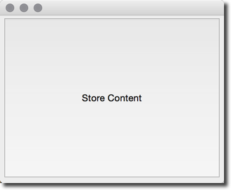
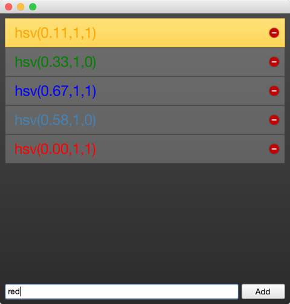

==========
Qt and C++
==========

.. sectionauthor:: `jryannel <https://github.com/jryannel>`_, `Carlos Hernandez <https://github.com/CharlieGearsTech>`_

.. issues:: ch15

.. note::

    Last Build: |today|
		
    El código fuente de este capitulo puede ser encontrado en la carpeta `assets <../../assets>`_.

Qt es un conjunto de herramientas de C++ con una extensión para QML y JavaScript. Existen muchos enlaces de lenguajes para Qt, pero como Qt es desarrollado en C++, el espíritu de C++ puede ser encontrado dentro de todas las clases de Qt. En esta sección, haremos una visita a Qt desde una perspectiva de C++ para construir un mejor entendimiento de como extender QML con plugins nativos desarrollados usando unicamente C++. A través de C++, es posible extender y controlar el ambiente de ejecución proveído por QML.

Este capitulo requerirá; solo para Qt, que el lector tenga conocimientos básicos de C++. Qt no esta basado en rasgos avanzados de C++, y yo generalmente considero el estilo de Qt en C++ bastante entendible, pero no te preocupes si tu conocimiento de C++ no es suficiente.

Abordando Qt desde una dirección de C++, vas a encontrar que Qt enriquece C++ con un numero de rasgos de lenguaje moderno permitidos por una introspección de datos disponibles. Esto es posible a través del uso de la clase base ``QObject``. Datos de introspección, o metadatos, mantienen información de la clase en tiempos de ejecución, algo que C++ ordinario no puede hacer. Esto permite probar objetos dinámicamente para información acerca de sus propiedades y métodos  disponibles.

Qt usa esta meta-información para permitir un concepto muy cercano a funciones callbacks usando señales y huecos. Cada señal puede ser conectado a  cualquier numero de huecos o inclusive a otras  señales. Cuando una  señal es emitida desde una instancia de objeto, los huecos conectados son invocados. Como los objetos donde se emite la  señal no necesita saber nada acerca del objeto que contiene el hueco y viceversa, este mecanismo es usado para crear componentes bastantes reusables con poca dependencia entre componentes.

The introspection features are also used to create dynamic language bindings, making it possible to expose a C++ object instance to QML and making C++ functions callable from Javascript. Other bindings for Qt C++ exist and besides the standard Javascript binding a popular one is the Python binding called `PyQt <http://www.riverbankcomputing.co.uk/software/pyqt/intro>`_.

En adición a este concepto central, Qt hace posible el desarrollo de aplicaciones multiplataformas usando C++. Qt C++ provee una plataforma de abstracción en los diferentes sistemas operativos, cuales permiten al desarrollador concentrarse en el trabajo en mando y no en los detalles de como se abre un archivo en diferentes sistemas operativos. Esto significa que tu puedes recompilar el mismo código fuente para Windows, OS X, y Linux; y Qt cuidara  las diferentes maneras de como diferentes sistemas operativos  manejan ciertas cosas. El resultado final son aplicaciones nativamente construidas que tienen el aspecto y el esencia de una plataforma objetivo. Como en los móviles-el nuevo escritorio, nuevas versiones de Qt pueden también apuntar a un numero de plataformas móviles usando el mismo código fuente, por ejemplo, iOS, Android, Jolla, BlackBerry, Ubuntu Phone, Tizen

Cuando viene a reuso, no solo el código fuente puede ser reusado, pero también las capacidades de desarrollo son reusables. Un equipo sabiendo Qt puede alcanzar  mas plataformas que un equipo que solo se enfoca en una plataforma en una tecnología en especifico, y como Qt es tan flexible, el equipo puede crear diferentes componentes de sistema usando la misma tecnología.

.. figure:: images/yourapplication.png

Para toda plataforma, Qt ofrece un conjunto de tipos básicos, por ejemplo, cadenas con soporte completo a Unicode, listas, vectores, buffers. También provee una abstracción en común para el ciclo principal de la plataforma objetivo, enhilado de diferentes plataformas, y soporte de redes. La filosofía general es que, para un desarrollador de aplicaciones, Qt viene con toda la funcionalidad necesaria incluida. Para trabajos específicos de dominio como  hacer una interfaz para tus librerías nativas, Qt viene con bastantes clases ayudantes para hacer esa interfaz mas fácil.

Una aplicación reusable
=========================

.. issues:: ch15

La mejor manera de entender Qt es empezando con una aplicación pequeña de demostración. Esta aplicación crea una simple cadena ``”Hello World”`` y escribe esto dentro de un archivo usando caracteres de unicode..

.. literalinclude:: src/coreapp/main.cpp
    :language: cpp

Este ejemplo simple demuestra el uso del acceso de archivo y la forma correcta de escribir texto dentro de un archivo usando encoders de texto vía un flujo de texto. Para datos binarios, hay un flujo binario multi-plataforma llamado ``QDataStream``. Las diferentes clases que usamos, están incluidas por su nombre de clase. Otra posibilidad puede ser de usar un modulo y un nombre de clase, por ejemplo, ``#include <QtCore/Qfile>`` Para el holgazán, hay también una posibilidad de incluir todo el modulo usando ``#include <QtCore>. Por ejemplo en ``QtCore``, tu tienes la mayoría de las clases comunes usados en la aplicación,  que no son dependencias UI.  Ve la lista de clases de `QCore <http://doc.qt.io/qt-5/qtcore-module.html>`_ o el `Introducción de QtCore <http://doc.qt.io/qt-5/qtcore-index.html>`_

Construyes la aplicación usando qmake o make. QMake lee un archivo de proyecto y genera un Makefile, cual entonces puede ser llamado usando make. El archivo de proyecto es independiente a la plataforma y qmake tiene ciertas reglas para aplicar en configuraciones especificas de plataforma para generar archivos make. EL proyecto puede también contener un alcance de plataforma para reglas especificas de plataforma, cuales son requeridos en ciertos casos. Aquí hay un ejemplo de un archivo de proyecto simple.

.. literalinclude:: src/coreapp/coreapp.pro
    :language: cpp

No vamos a ir mas adentro dentro de este tema. Solo recuerda que Qt usa archivos de proyecto para proyectos y qmake genera los archivos make específicos de la plataforma desde estos archivos de proyecto..

El ejemplo de código simple de arriba solo escribe el texto y cierra la aplicación. Para una herramienta de linea de comando, esto es suficiente. Para un interfaz de usuario, vas a necesitar un ciclo de eventos cual espera para una entrada de usuario y de alguna manera organiza operaciones de re-dibujado. Entonces el siguiente ejemplo usara un botón de escritorio para disparar la escritura en el archivo.

Nuestro ``main.cpp`` sorprendentemente esta mas pequeño. Movimos el código dentro de una clase propia para poder usar señales y huecos, para la entrada de usuario, por ejemplo, el click del botón. El mecanismo de señales y huecos normalmente necesita una instancia de objeto, como veras enseguida.

.. literalinclude:: src/uiapp/main.cpp
    :language: cpp

En la función ``main``, nosotros simplemente creamos un objeto de aplicación y empezamos el ciclo de eventos usando ``exec()``. Por ahora, la aplicación se siente en el ciclo de evento y espera para una entrada de usuario.

.. code-block:: cpp

    int main(int argc, char** argv)
    {
        QApplication app(argc, argv); // Inicializa aplicacion

        // Crea el UI

        return app.exec(); // Ciclo de ejecucion de eventos
    }

Qt ofrece bastantes tecnologías UI. Para este ejemplo, usamos la librería de  interfaz de usuario de Widgets de escritorio usando puro Qt C++. Nosotros creamos una ventana principal, cual va a mantener un botón de presión  para disparar la funcionalidad, y también la ventana principal va a mantener nuestra funcionalidad principal cual nosotros conocemos del ejemplo pasado.

La ventana principal en si, es un widget. Se vuelve una ventana de nivel alto ya que no tiene ningún padre. Esto viene de que Qt ve una interfaz de usuario como un árbol de elementos de interfaz de usuario. En este caso, la ventana principal es un elemento base, entonces se convierte en ventana, mientras que el botón de presión es un hijo de la ventana principal y se vuelve un widget dentro de la ventana.

.. literalinclude:: src/uiapp/mainwindow.h
    :language: cpp

Adicionalmente, nosotros definimos un hueco publico llamado ``storeContent()``, cual deberá ser llamado cuando el botón es presionado. Un hueco es un método de C++ cual es registrado con el sistema de meta-objetos de Qt y puede ser llamado dinámicamente.

.. literalinclude:: src/uiapp/mainwindow.cpp
    :language: cpp

En la ventana principal, primero creamos un botón de presión y entonces registramos la señal ``clicked()`` con el hueco ``storeContent()`` usando el método conectado. Cualquier tiempo, que la señal  es emitida, el hueco ``storeContent()`` es llamado. Tan simple como esto, objetos se comunican mediante  señales y huecos sin ninguna relación entre ellos.

El QObject
===========

.. issues:: ch15

Como fue descrito en la introducción, el ``QObject`` es lo que permite la introspección de Qt. Es la clase base de casi toda clase en Qt. Excepciones son tipos de valores como ``QColor``, ``QString``, y ``QList``.

Un objeto Qt es un objeto estándar de C++, pero con mas habilidades. Estos pueden ser divididos dentro de 2 grupos: introspección y manejo de memoria. El primero significa que un objeto Qt esta consciente de su nombre de clase, su relación con otras clases, como también sus métodos y propiedades. El concepto de manejo de memoria significa que cada objeto Qt puede ser padre de objetos hijos. El padre *tiene* a los hijos, y cuando el padre es destruido, es responsable de destruir sus hijos.

La mejor manera de entender como las habilidades de ``QObject`` afectan a una clase es tomando una clase de C++ estándar y activarlo con Qt. La clase que se muestra abajo representa una clase ordinaria de ese tipo.

La clase persona es una clase de datos con un nombre y unas propiedades de genero. La clase persona usa el sistema de objetos de Qt para agregar meta-información  para la clase de C++. Esto permite usuarios de un objeto persona conectar con huecos y ser notificados cuando las propiedades hayan cambiado.

.. code-block:: cpp

    class Person : public QObject
    {
        Q_OBJECT // permite meta-objetos

        // Declaraciones de propiedades para QML
        Q_PROPERTY(QString name READ name WRITE setName NOTIFY nameChanged)
        Q_PROPERTY(Gender gender READ gender WRITE setGender NOTIFY genderChanged)

        // Permite introspeccion de Enums
        Q_ENUMS(Gender)

    public:
        // Constructor de Qt estandar con un padre para manejo de memoria.
        Person(QObject *parent = 0);

        enum Gender { Unknown, Male, Female, Other };

        QString name() const;
        Gender gender() const;

    public slots: // huecos que se conectan a señales
        void setName(const QString &);
        void setGender(Gender);

    signals: // señales que pueden ser emitidos
        void nameChanged(const QString &name);
        void genderChanged(Gender gender);

    private:
        // Miembros de datos.
        QString m_name;
        Gender m_gender;
    };

El constructor pasa al padre a la súper clase e inicializa los miembros. Las clases de valores de Qt son automáticamente inicializados. En este caso ``Qstring`` va a inicializarse con una cadena nula (``Qstring::isNull()``) y el miembro de genero va a ser explícitamente inicializado para un genero desconocido.

.. code-block:: cpp

    Person::Person(QObject *parent)
        : QObject(parent)
        , m_gender(Person::Unknown)
    {
    }

La función de recepción es llamado después de la propiedad y es normalmente una función constante (``const``). Los transmisores emiten la señal de cambio cuando la propiedad realmente ha sido cambiado. Para esto, podemos insertar un guardián para comparar el valor actual con un nuevo valor. Y solo cuando el valor difiere, nosotros le asignamos para la variable miembro y emitimos la señal de cambio.

.. code-block:: cpp

    QString Person::name() const
    {
        return m_name;
    }

    void Person::setName(const QString &name)
    {
        if (m_name != name) // guard
        {
            m_name = name;
            emit nameChanged(m_name);
        }
    }

Teniendo una clase derivada de ``QObject``, hemos ganado mas habilidades de meta-objetos que podemos explorar usando el método ``metaObject()``. Por ejemplo, mostrando el nombre de la clase desde el objeto.

.. code-block:: cpp

    Person* person = new Person();
    person->metaObject()->className(); // "Person"
    Person::staticMetaObject.className(); // "Person"

Aquí hay mas rasgos que pueden ser accesados por la clase base ``QObject`` y el meta-objeto. Por favor, revisa la documentación de `QMetaObject``.

Sistemas de Construcción
=============

.. issues:: ch15

Construyendo software confiable en diferentes plataformas puede ser un trabajo complejo. Puedes encontrarte con diferentes ambientes con diferentes compiladores, direcciones, y variaciones de librería. El propósito de Qt es de proteger el desarrollador de aplicaciones de estos problemas de multi-plataforma. Para esto, Qt introduce el generador de archivos de construcción ``qmake``. ``qmake`` opera en un archivo de proyecto( con terminación ``.pro``). Este archivo de proyecto contiene instrucciones acerca de la aplicación y las fuentes que pueden ser usados. Ejecutando ``qmake`` en este archivo de proyecto va a generar un ``MakeFile`` para ti en Unix, Mac e inclusive en Windows (si tiene usando  el conjunto de herramientas con compilador mingw). De otra forma, puede crear un proyecto de visual studio o un proyecto de XCode.

Un flujo de construcción típica en Qt en Unix puede ser:
    $ editar myproject.pro
    $ qmake // Genera Makefile
    $ make

Qt te permite también usar construcciones sombras. Una construcción sombra es una construcción afuera de tu zona de código fuente. Asume que tenemos una carpeta myproject con un archivo ``myproject.pro``. EL flujo puede ser como este:

    $ mkdir build
    $ cd build
    $ qmake ../myproject/myproject.pro

Nosotros creamos una carpeta de construcción y entonces llamamos qmake desde afuera de la carpeta de construcción con la localización de nuestra carpeta del proyecto. Con esto, configuramos el archivo make en una manera que todo artefacto de construcción es guardado dentro de una carpeta de construcción en vez de adentro de la carpeta del código fuente. Esto nos permite crear construcciones de diferentes versiones de Qt y configuraciones de construcción en el mismo tiempo, y ademas  no amontona nuestra carpeta de código fuente, que siempre es algo bueno.

Cuando estamos usando Qt Creator, este IDE hace las cosas atrás de las escenas para que no te tengas que preocupar por estos pasos usuales. Para proyectos grandes y para un mayor entendimiento del flujo, es recomendado que aprendas como construir tus propios proyectos de Qt desde la linea de comandos.

QMake
-----

.. issues:: ch15

Qmake es una herramienta que lee tu archivo de proyecto y genera un archivo de construcción. Un archivo de proyecto es una escritura simplificada de las configuraciones de tu proyecto, dependencias externas y tus archivos fuentes. El archivo mas simple puede ser probablemente esto::

    // myproject.pro

    SOURCES += main.cpp

Aquí construimos una aplicación ejecutable que va a tener el nombre de ``myproject`` basado en el nombre del archivo de proyecto. La construcción solo contiene el código fuente de ``main.cpp`` Y por defecto, vamos a usar los módulos QtCore y QtGui para este proyecto. Si nuestro proyecto es una aplicación QML, necesitaremos agregar los módulos QtQuick y QtQml en la lista::

    // myproject.pro

    QT += qml quick

    SOURCES += main.cpp

Ahora nuestro archivo de construcción conoce el enlace para los módulos QtQml y QtQuick. Qmake usa el concepto de ``=``, ``+=`` y ``-=`` para asignar, agregar y remover elementos de la lista de opciones, respectivamente. Para una construcción pura de consola sin dependencias de interfaz de usuario, tu puedes remover el modulo QtGui::

    // myproject.pro

    QT -= gui

    SOURCES += main.cpp

Cuando quieras construir una librería en vez de una aplicación, debes de cambiar la plantilla de construcción::

    // myproject.pro
    TEMPLATE = lib

    QT -= gui

    HEADERS += utils.h
    SOURCES += utils.cpp

Ahora, el proyecto va a construirse como librería sin dependencias de interfaz de usuario y usa el encabezado ``utils.h`` y el código fuente ``utils.cpp``. El formato de la librería va a depender del sistema operativo que estas construyendo en el proyecto.

Normalmente tu vas a tener unas configuraciones mas complicadas y vas a necesitar construir conjuntos de proyectos. Para esto, qmake ofrece la plantilla ``subdirs``. Asume que queremos hacer un proyecto librería (mylib) y un proyecto aplicación (myapp). Entonces nuestra configuración puede ser como esto::

    my.pro
    mylib/mylib.pro
    mylib/utils.h
    mylib/utils.cpp
    myapp/myapp.pro
    myapp/main.cpp

Nosotros ya sabemos como mylib.pro y myapp.pro son. El my.pro como un archivo de proyecto enlazador puede parecer como esto::

    // my.pro
    TEMPLATE = subdirs

    subdirs = mylib \
        myapp

    myapp.depends = mylib

Esto declara un proyecto con 2 sub-proyectos: ``mylib`` y ``myapp``, donde ``myapp`` depende de ``mylib``. Cuando qmake se ejecuta en este archivo de proyecto, va a generar un archivo de construcción para cada proyecto en la carpeta correspondiente. Cuando ejecutas el archivo make para ``my.pro``, todos los sub-proyectos serán construidos.

Aveces, necesitaras hacer una cosa en una plataforma, y esta otra cosa en otra plataforma basada en tu configuración. Para esto qmake introduce el concepto de alcances. Un alcance es aplicado cuando una opción de configuración es establecida como verdadera.

Por ejemplo, para usar una implementación de utilidades especifica para Unix, puedes usar::

    unix {
        SOURCES += utils_unix.cpp
    } else {
        SOURCES += utils.cpp
    }

Lo que dice es que si la variable CONFIG contiene una opción de unix, entonces aplica el alcance; de otra forma usa el camino “entonces”. Algo típico es el de remover  un empaquetamiento de aplicación dentro de mac::

    macx {
        CONFIG -= app_bundle
    }

Esto creara una aplicación en un ejecutable plano dentro de mac y no como una carpeta ``.app`` que es usada en la instalación de la aplicación.

Proyectos basados en Qmake son normalmente el numero uno en ser escogidos cuando empiezas programando aplicaciones de Qt. También hay otras opciones en la industria. Todos tienen sus beneficios y desventajas. Vamos a discutir estas opciones rápidamente.

.. rubric:: References

* :qt5:`QMake Manual <qmake-manual>` - Tabla de contenido de qmake.

* :qt5:`QMake Language <qmake-language>` - Asignacion de valores, alcances y asi.

* :qt5:`QMake Variables <qmake-variable-reference>` - Variables como TEMPLATE, CONFIG y QT son explicados aqui.

CMake
-----

.. issues:: ch15

CMake es una herramienta creada por Kitware. Kitware es bastante famoso por su software de visualización 3D VTK , y también CMake, el generador de archivos make multi-plataforma. Usa una seria de archivos ``CmakeLists.txt`` para generar archivos make de una plataforma especifica. CMake es usado en el proyecto KDE y debido a esto, tiene una relacion especial con la comunidad Qt.

El ``CmakeLists.txt`` es el archivo usado para guardar las configuraciones de proyecto. Es un simple hello world usando QtCore, el archivo de proyecto puede parecerse a esto:

    // Asegura la version de cmake es al menos 3.0
    cmake_minimum_required(VERSION 3.0)
    // Agrega la localizacion de la fuente y construccion en la direccion incluida.
    set(CMAKE_INCLUDE_CURRENT_DIR ON)
    // Herramienta de MOC en Qt debera ser automaticamente invocado.
    set(CMAKE_AUTOMOC ON)
    // Usando el modulo QtCore5
    find_package(Qt5Core)
    // Crear un helloworld ejecutable usando main.cpp
    add_executable(helloworld main.cpp)
    // helloworld enlaza con Qt5Core
    target_link_libraries(helloworld Qt5::Core)

Esto va a construir un ejecutable helloworld usando main.cpp y enlazarlo contra la librería externa Qt5Core. El archivo de construcción puede ser modificado para ser mas genérico::

    // Establece la variable PROJECT_NAME
    project(helloworld)
    cmake_minimum_required(VERSION 3.0)
    set(CMAKE_INCLUDE_CURRENT_DIR ON)
    set(CMAKE_AUTOMOC ON)
    find_package(Qt5Core)

    // Crea la variable SRC_LIST con main.cpp en una sola entrada.
    set(SRC_LIST main.cpp)
    // Agregar un ejecutable basado en el nombre del proyecto y la lista de codigo fuente.
    add_executable(${PROJECT_NAME} ${SRC_LIST})
    // Conecta Qt5Core con el ejecutable del proyecto.
    target_link_libraries(${PROJECT_NAME} Qt5::Core)

Tu puedes ver que CMake es bastante poderoso. Toma algo de tiempo para acostumbrarse a la sintaxis. En general, es dicho que CMake es mejor para proyectos complejos y largos.

.. rubric:: References

* `Ayuda CMake <http://www.cmake.org/documentation/>`_ -disponbile en linea pero tambien en formato QtHelp.
* `Ejecutando CMake <http://www.cmake.org/runningcmake/>`_
* `Tutorial de KDE CMake  <https://techbase.kde.org/Development/Tutorials/CMake>`_
* `Libro de CMake <http://www.kitware.com/products/books/CMakeBook.html>`_
* `CMake y Qt <http://www.cmake.org/cmake/help/v3.0/manual/cmake-qt.7.html>`_

Clases comunes de Qt
=================

.. issues:: ch15

La clase ``QObject`` forma los fundamentos de Qt, pero también hay mas clases en el framework. Antes de continuar viendo en QML y ver como extenderlo, vamos a ver algunas cosas básicas de las clases de Qt que son útiles para saber.

Los ejemplos de código mostrados en esta sección están escritos usando la librería Qt Test. Esta librería ofrece una buena manera de explorar la API de Qt y guardarlo para una referencia posterior. ``QVERIFY``, ``QCOMPARE`` son funciones proveídas por la librería de prueba para asegurar una condición especifica. Usamos el alcance ``{}`` para evitar colisiones de nombre. Entonces no te confundas.

QString
-------

En general, el manejar de texto en Qt esta basado en Unicode. Para esto, tu puedes usar la clase ``QString``. Esta clase viene con una variedad de funciones buenas que puedes esperar de frameworks modernos. Para datos de 8-bits, tu puedes usar normalmente la clase ``QByteArray`` y para identificadores de ASCII, usa ``QLatin1String`` para preservar memoria. Para una lista de cadenas, puedes usar ``QList<QString>`` o simplemente la clase ``QstringList`` ( que esta derivando de  ``QList<QString>``).

Aquí hay algunos ejemplos de como usar la clase ``QString``. QString puede ser creado en la pila pero guarda sus datos en el “heap”.  También cuando asignamos una cadena con otra, los datos no van a ser copiados- solo hacer referencia a sus datos. Esto es realmente barato y permite al desarrollador concentrarse en el código y no en el manejo de memoria. ``QString`` usa contadores de referencia para conocer cuando los datos pueden ser eliminados con seguridad. Este rasgo es llamado :qt5:` Compartir Implícito <implicit-sharing>` y es usado en muchas clases de Qt.

.. literalinclude:: src/qtfoundation/tst_foundation.cpp
    :language: cpp
    :start-after: M1>>
    :end-before:  M1<<

Aquí vamos a mostrar como convertir un numero a cadena y viceversa. Aquí también hay funciones de conversión para números flotantes y otros tipos. Solo busca la función que usamos aquí en la documentación de Qt y encontraras otras funciones.

.. literalinclude:: src/qtfoundation/tst_foundation.cpp
    :language: cpp
    :start-after: M2>>
    :end-before:  M2<<

Normalmente en texto, tu necesitas texto parametrizado. Una opción puede ser el uso de ``QString(“Hello” + name)`` pero una manera mas flexible es usando el marcador ``arg``. Esto también preserva el orden durante traducción cuando el orden puede ser cambiado.

.. literalinclude:: src/qtfoundation/tst_foundation.cpp
    :language: cpp
    :start-after: M3>>
    :end-before:  M3<<

Aveces tu querrás usar caracteres unicode directamente en tu código. Para hacer esto tu necesitas recordar como marcarlos para las clases ``QChar`` y ``QString`` 

.. literalinclude:: src/qtfoundation/tst_foundation.cpp
    :language: cpp
    :start-after: M4>>
    :end-before:  M4<<

Esto te da algunos ejemplos de como fácilmente tu puedes tratar texto Unicode en Qt. Para texto no-Unicode, la clase ``QByteArray`` también tiene bastantes funciones ayudantes para conversiones. Por favor, lee la documentación de Qt para ``QString``, ya que contiene toneladas de buenos ejemplos.

Contenedores secuenciales
---------------------

Una lista, cola, vector o lista enlazada es un contenedor secuencial. El contenedor secuencial mas usado es la clase ``QList``. Es una clase genérica y necesita ser inicializada con un tipo. Es también compartido implícitamente y guarda los datos internamente en el “heap”.  Toda clase contenedor deberá ser creado en la pila. Normalmente tu nunca quieres usar ``new QList<T>()``, que significa que nunca deberás usar ``new`` con un contenedor.

``QList`` es tan versátil como la clase ``QString``  y ofrece una gra API para explorar tus datos. Abajo hay un pequeño ejemplo de como usar e iterar a través de una lista usando algunos rasgos nuevos de C++ 11. 

.. literalinclude:: src/qtfoundation/tst_foundation.cpp
    :language: cpp
    :start-after: M5>>
    :end-before:  M5<<

Contenedores Asociativos
----------------------

Un mapa, un diccionario, o un conjunto son ejemplos de contenedores asociativos. Ellos guardan un valor usando una llave. Estos contenedores son famosos por sus búsquedas rápidas. Aquí demostramos el uso de el contenedor asociativo mas usado, el ``Qhash``; también demostrando algunos rasgos nuevos de C++11.

.. literalinclude:: src/qtfoundation/tst_foundation.cpp
    :language: cpp
    :start-after: M6>>
    :end-before:  M6<<

Archivo I/O
-------

Es bastante requerido el leer y escribir en archivos. ``QFile`` es un ``QObject`` pero es la mayoría de los casos es creado en la pila. ``QFile`` contiene señales para informar el usuario cuando los datos pueden ser leídos. Esto permite leer pedazos de datos de modo asíncrono hasta que el archivo completo sea leído. Por conveniencia, también permite leer datos en modo bloqueado. Esto deberá ser usado unicamente para pequeñas cantidades de datos y no para archivos largos. Afortunadamente, solo leemos pequeños pedazos de datos en estos ejemplos.

Aparte de leer datos crudos desde un archivo usando un ``QByteArray``, tu también puedes leer datos de otros tipos usando ``QDataStream`` y cadenas Unicode usando ``QTextStream``. Te mostraremos como hacerlo.

.. literalinclude:: src/qtfoundation/tst_foundation.cpp
    :language: cpp
    :start-after: M7>>
    :end-before:  M7<<

Mas Clases
------------

.. issues:: ch15
Qt es un framework de aplicaciones rico. Ya que tiene miles de clases. Toma algo de tiempo acostumbrarse a todas estas clases y como usarlos. Afortunadamente, Qt tiene una buena documentación  con muchos ejemplos incluidos. Mucho de tu tiempo, estas buscando por una clase de acuerdo con tu interés, y los casos de uso mas comunes están ofrecidos como muestras de código. Lo cual significa que solo copias y adaptas estas muestras de código. También ejemplos de Qt en el código fuente de Qt es de gran ayuda. Ten por seguro que estos sean disponibles para hacer tu vida mas productiva. No pierdas tiempo. La comunidad de Qt también es muy útil, cuando preguntes es muy útil preguntar preguntas exactas y proveer un ejemplo simple que despliegue tus necesidades. Esto drásticamente mejorara el tiempo de respuesta de otros. Entonces invierte un poco de tiempo para hacer la vida de los otros que quieren ayudarte, mas fácil.

Aquí hay algunas clases que su documentación, el autor piensa que tienes que leerlo: :qt5:`QObject <qobject>`, :qt5:`QString <qstring>`, :qt5:`QByteArray <qbytearray>`, :qt5:`QFile <qfile>`, :qt5:`QDir <qdir>`, :qt5:`QFileInfo <qfileinfo>`, :qt5:`QIODevice <qiodevice>`, :qt5:`QTextStream <qtextstream>`, :qt5:`QDataStream <qdatastream>`, :qt5:`QDebug <qdebug>`, :qt5:`QLoggingCategory <qloggingcategory>`, :qt5:`QTcpServer <qtcpserver>`, :qt5:`QTcpSocket <qtcpsocket>`, :qt5:`QNetworkRequest <qnetworkrequest>`, :qt5:`QNetworkReply <qnetworkreply>`, :qt5:`QAbstractItemModel <qabstractitemmodel>`, :qt5:`QRegExp <qregexp>`, :qt5:`QList <qlist>`, :qt5:`QHash <qhash>`, :qt5:`QThread <qthread>`, :qt5:`QProcess <qprocess>`, :qt5:`QJsonDocument <qjsondocument>`, :qt5:`QJSValue <qjsvalue>`.

Esto debería ser suficiente por ahora.

Modelos en C++
=============

Modelos en QML sirven con el propósito de proveer datos de ``ListViews``, ``PathViews`` y otras vistas que toman un modelo y crear una instancia de cada delegado para cada entrada en el modelo. La vista es lo suficientemente inteligente para crear estas instancias, que son visible so que están en el rango del cache. Esto hace posible tener modelos grandes con cientos de miles de entradas pero aun así tiene un interfaz. El delegado actuá como una plantilla para ser renderizado con datos de entrada de modelo. En resumen: una vista despliega las entradas de un modelo usando un delegado como una plantilla. El modelo es el proveedor de datos para las vistas.

Cuando no quieras usar C++, puedes definir modelos puros en QML. Tu tienes bastantes maneras de proveer un modelo para una vista. Para manipulación de datos viniendo  de datos desde C++ o grandes cantidades de datos, el modelo de C++ es mas adecuado que las maneras de QML. Pero normalmente solo ocupas algunas entradas, entonces estos modelos QML serán muy útiles.

.. code-block:: qml

    ListView {
        // using a integer as model
        model: 5
        delegate: Text { text: 'index: ' + index }
    }

    ListView {
        // using a JS array as model
        model: ['A', 'B', 'C', 'D', 'E']
        delegate: Text { 'Char['+ index +']: ' + modelData }
    }

    ListView {
        // using a dynamic QML ListModel as model
        model: ListModel {
            ListElement { char: 'A' }
            ListElement { char: 'B' }
            ListElement { char: 'C' }
            ListElement { char: 'D' }
            ListElement { char: 'E' }
        }
        delegate: Text { 'Char['+ index +']: ' + model.char }
    }

La vista de QML sabe como usar  estos diferentes modelos. Para modelos viniendo del mundo de C++, la vista espera un protocolo especifico a seguir. Este protocolo esta definido en la API (``QAbstractItemModel``)  junto con la documentación para un comportamiento dinámico. La API fue desarrollado para el mundo de widgets de escritorio y puede ser usada unicamente con versiones de lista de la API (``QAbstractListModel``). La API contiene algunas funciones obligatorias para ser implementados y algunas son opcionales. Las partes opcionales, la mayoría de las veces manipulan el caso de uso dinámico de agregar o remover datos.

Un modelo simple
--------------

Un modelo de QML y C++ deriva de ``QAbstractListModel`` e implementa al menos las funciones de ``data`` y ``rowCount``. En este ejemplo, vamos a usar una serie de nombres de colores de SVG proveídos por la clase ``QColor`` y mostrarlos usando nuestro modelo. Los datos son guardados dentro de un contenedor de datos ``QList<QString>``.

Nuestro ``DataEntryModel`` deriva de ``QabstractListModel`` e implementa las funciones obligatorias. Nosotros podemos ignorar a los padres en ``rowCount`` ya que esto es usado unicamente para un modelo de arbol. La clase ``QmodelIndex`` provee la información de renglón y columna para la celda, de los cuales la vista quiere recibir datos. La vista esta jalando información para el modelo en un renglón/columna, y en una base de rol. El ``QAbstractListModel`` es definido en ``QtCore`` pero ``QColor` en ``QtGui`. Es por ello que tenemos la dependencia adicional de ``QtGui``. Para aplicaciones QML, esta bien el depender en ``QtGui`` pero normalmente no deberá de depender en ``QtWidget``.

.. literalinclude:: src/modelview/dataentrymodel.h
    :language: cpp

En el lado de la implementación, la parte mas compleja es la función de datos. Primero debemos de marcar un chequeo de rango. Y luego checamos el rol de muestra. El ``Qt::DisplayRole`` es el rol de texto por defecto que una vista va a preguntar por el. Hay un pequeño conjunto de roles por defecto definidos en Qt cuales pueden ser usados, pero normalmente un modelo puede definir sus propios roles para claridad. Toda llamada que no contenga el rol de muestra, son ignorados por el momento , y el valor por defecto ``QVariant()`` es retornado.

.. literalinclude:: src/modelview/dataentrymodel.cpp
    :language: cpp

El siguiente paso puede ser registrar el modelo con QML usando la llamada ``qmlRegisterType``. Esto esta hecho adentro del ``main.cpp`` antes que el archivo QML es agregado.

.. code-block:: cpp

    #include <QtGui>
    #include <QtQml>

    #include "dataentrymodel.h"

    int main(int argc, char *argv[])
    {
        QGuiApplication app(argc, argv);

        // register the type DataEntryModel
        // under the url "org.example" in version 1.0
        // under the name "DataEntryModel"
        qmlRegisterType<DataEntryModel>("org.example", 1, 0, "DataEntryModel");

        QQmlApplicationEngine engine;
        engine.load(QUrl(QStringLiteral("qrc:/main.qml")));

        return app.exec();
    }

Ahora puedes accesar el ``DataEntryModel`` usando la oración importada de QML ``import org.example 1.0`` y usarlo como otro articulo de QML ``DataEntryModel {}``.

Usamos esto en este ejemplo para mostrar una lista simple de entradas de color.

.. code-block:: qml

    import org.example 1.0

    ListView {
        id: view
        anchors.fill: parent
        model: DataEntryModel {}
        delegate: ListDelegate {
            // use the defined model role "display"
            text: model.display
        }
        highlight: ListHighlight { }
    }

El ``ListDelegate`` es un tipo personalizado que despliega algo de texto. El ``ListHighlight`` es solo un rectángulo. El código es extraído para mantener el ejemplo compacto.
La vista puede ahora mostrar la lista de cadenas usando el modelo de C++ y la propiedad de vista del modelo. Y sigue siendo bastante simple, pero ahora realmente usado en QML. Normalmente los datos son puestos desde afuera del modelo y el modelo puede actuar como una interfaz para la vista.

Datos Mas Complejos
-----------------

En realidad los datos del modelo son mucho mas complejos. Entonces es una necesidad el definir roles personalizados para que la vista pueda encolar otros datos mediante propiedades. Por ejemplo, el modelo puede proveer no solo un color como una cadena hexadecimal, pero también puede un hue, saturación y intensidad desde un modelo de color HSV como “model.hue”, “model.saturation” y “model.brightness” en QML.

.. literalinclude:: src/modelview/roleentrymodel.h
    :language: cpp

En el encabezado agregamos el mapeo de roles para ser usados en QML. Cuando QML trata de acceder una propiedad desde el modelo (ejemplo, “model.name”) la listview va a buscar el mapeo para “name” y va a preguntar el modelo por los datos usando el ``NameRole``. Roles definidos por el usuario deberán de empezar con ``Qt::UserRole`` y necesitan ser únicos para cada modelo.

.. literalinclude:: src/modelview/roleentrymodel.cpp
    :language: cpp

The implementation now has changed only in two places. First in the initialization. We now initialize the data list with QColor data types. Additionally we define our role name map to be accessible for QML. This map is returned later in the ``::roleNames`` function.

El segundo cambio es el de la función ``::data``. Nosotros extendemos el switch para cubrir los otros roles (ejemplo, hue,saturación, intensidad). Aquí no hay manera de retornar un nombre SVG desde color, ya que el color solo puede ser tomado desde cualquier otro color y los nombres de SVG son limitados. Entonces ignoramos esto. Guardando los nombres puede requerir el crear una estructura ``struct { QColor, QString}`` para ser capaz de identificar el color nombrado.
Después de registrar el tipo, podemos usar el modelo y sus entradas en nuestra interfaz de usuario.

.. code-block:: qml

    ListView {
        id: view
        anchors.fill: parent
        model: RoleEntryModel {}
        focus: true
        delegate: ListDelegate {
            text: 'hsv(' +
                  Number(model.hue).toFixed(2) + ',' +
                  Number(model.saturation).toFixed() + ',' +
                  Number(model.brightness).toFixed() + ')'
            color: model.name
        }
        highlight: ListHighlight { }
    }

Hemos convertido los tipos de retorno para los tipos de numero de JS para ser capaz de formatear el numero usando notación de punto fijo. El código puede también trabajar sin la llamada de Number (ejemplo, crudo ``model.saturation.toFixed(2)``). Cual formato es escogido, depende de que tanto confiás en los datos entrantes.

Datos Dinamicos
------------

Dynamic data covers the aspects of inserting, removing and clearing the data from the model. The ``QAbstractListModel`` expect a certain behavior when entries are removed or inserted. The behavior is expressed in signals which needs to be called before and after the manipulation. For example to insert a row into a model you need first to emit the signal ``beginInsertRows``, then manipulate the data and then finally emit ``endInsertRows``.

We will add the following functions to our headers. These functions are declared using ``Q_INVOKABLE`` to be able to call them from QML. Another way would be to declare them a public slots.

.. code-block:: cpp

    // inserts a color at the index (0 at begining, count-1 at end)
    Q_INVOKABLE void insert(int index, const QString& colorValue);
    // uses insert to insert a color at the end
    Q_INVOKABLE void append(const QString& colorValue);
    // removes a color from the index
    Q_INVOKABLE void remove(int index);
    // clear the whole model (e.g. reset)
    Q_INVOKABLE void clear();

Additionally we define a ``count`` property to get the size of the model and a ``get`` method to get a color at the given index. This is useful when you would like to iterate over the model content from QML.

.. code-block:: cpp

    // gives the size of the model
    Q_PROPERTY(int count READ count NOTIFY countChanged)
    // gets a color at the index
    Q_INVOKABLE QColor get(int index);

The implementation for insert checks first the boundaries and if the given value is valid. Only then do we begin inserting the data.

.. code-block:: cpp

    void DynamicEntryModel::insert(int index, const QString &colorValue)
    {
        if(index < 0 || index > m_data.count()) {
            return;
        }
        QColor color(colorValue);
        if(!color.isValid()) {
            return;
        }
        // view protocol (begin => manipulate => end]
        emit beginInsertRows(QModelIndex(), index, index);
        m_data.insert(index, color);
        emit endInsertRows();
        // update our count property
        emit countChanged(m_data.count());
    }

Append is very simple. We reuse the insert function with the size of the model.

.. code-block:: cpp

    void DynamicEntryModel::append(const QString &colorValue)
    {
        insert(count(), colorValue);
    }

Remove is similar to insert but it calls according to the remove operation protocol.

.. code-block:: cpp

    void DynamicEntryModel::remove(int index)
    {
        if(index < 0 || index >= m_data.count()) {
            return;
        }
        emit beginRemoveRows(QModelIndex(), index, index);
        m_data.removeAt(index);
        emit endRemoveRows();
        // do not forget to update our count property
        emit countChanged(m_data.count());
    }

The helper function ``count`` is trivial. It just returns the data count. The ``get`` function is also quite simple.

.. code-block:: cpp

    QColor DynamicEntryModel::get(int index)
    {
        if(index < 0 || index >= m_data.count()) {
            return QColor();
        }
        return m_data.at(index);
    }

You need to be carefull that you only return a value which QML understands. If it is not one of the basic QML types or types kown to QML you need to register the type first with ``qmlRegisterType`` or ``qmlRegisterUncreatableType``. You use ``qmlRegisterUncreatableType`` if the user shall not be able to instantiate its own object in QML.

Now you can use the model in QML and insert, append, remove entries from the model. Here is a small example which allows the user to enter a color name or color hex value and the color is then appended onto the model and shown in the list view. The red circle on the delegate allows the user to remove this entry from the model. After the entry is remove the list view is notified by the model and updates its content.

|

And here is the QML code. You find the full source code also in the assets for this chapter. The example uses the QtQuick.Controls and QtQuick.Layout module to make the code more compact. These controls module provides a set of desktop related ui elements in QtQuick and the layouts module provides some very useful layout managers.

.. literalinclude:: src/modelview/main.qml
    :language: qml

Model view programming is one of the hardest tasks in Qt. It is one of the very few classes where you have to implement an interface as a normal application developer. All other classes you just use normally. The sketching of models should always start on the QML side. You should envision how your users would use your model inside QML. For this it is often a good idea to create a prototype first using the ``ListModel`` to see how this best works in QML. This is also true when it comes to defining QML APIs. Making data available from C++ to QML is not only a technology boundary it is also a programming paradigm change from imperative to declarative style programming. So be prepared for some set backs and aha moments:-).

Advanced Techniques
-------------------

